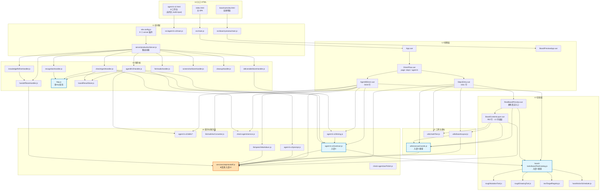
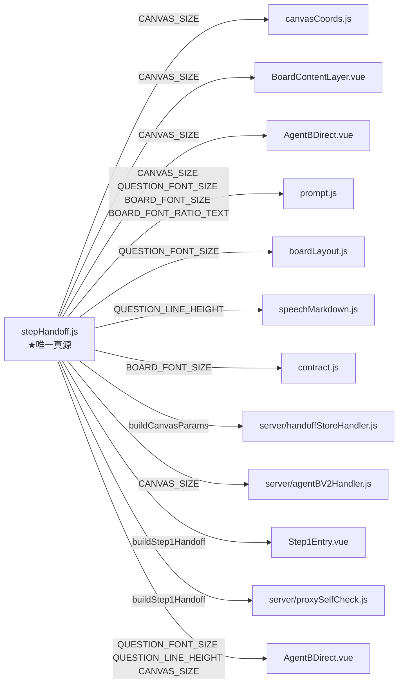
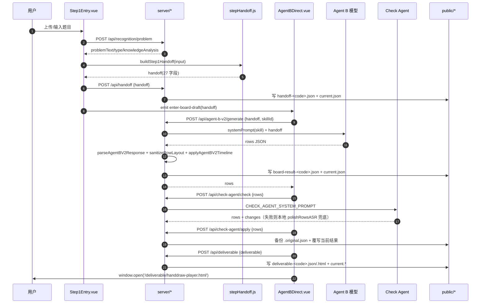
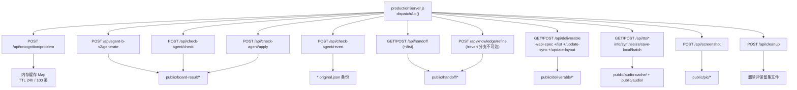
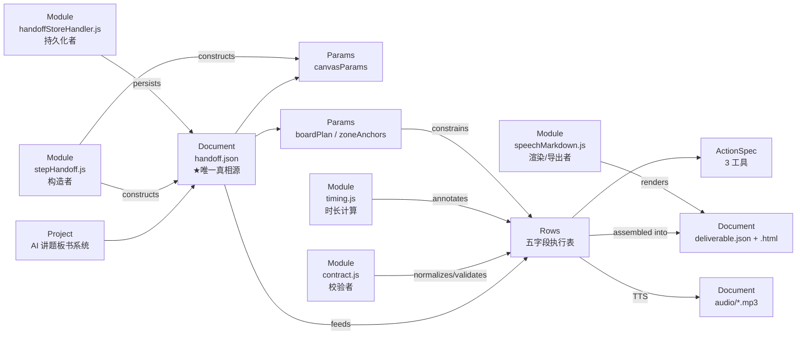

# X-RAY 全局图谱（4 层深度）

> 生成于 2026-09-14，只读勘探产出，未修改任何源码。
> 事实源优先级：**运行时代码 > 本文档 > 记忆**。本文档可能过期，引用前回代码核对。
> 排除：`node_modules/`、`public/` 产物快照、`skills/*.html`（测试页，非真相）。

---

## 图 0 — 全局分层总览（第 1 层 + 第 2 层）



**结论**
- **循环依赖：无**（全图 DAG）。
- 枢纽（入度 ≥4）：`stepHandoff.js`(10) · `boardToolCatalog.js`(5) · `canvasCoords.js`(5) · `contract.js`(4) · `http.js`(server 侧全部)。
- 单向链：`canvasCoords ← boardLayout ← BoardContentLayer`，`stepHandoff` 为**零依赖底座**（不 import 任何内部模块）。

---

## 图 1 — 第 3 层：真源与消费关系（以 stepHandoff.js 为核心）



真源导出（`stepHandoff.js`）:
| 符号 | 行 | 值/职责 |
|---|---|---|
| `CANVAS_SIZE` | 12 | 1726×980 |
| `COORDINATE_SYSTEM` | 13 | 百分比坐标 0-100 |
| `QUESTION_FONT_SIZE` | 14 | 30 |
| `QUESTION_LINE_HEIGHT` | 15 | 1.65 |
| `BOARD_FONT_SIZE` | 16 | 35 |
| `BOARD_FONT_RATIO_TEXT` | 17 | 约题目 1.2~1.5 倍 |
| `HANDWRITING_FAMILY` / `_CSS_HREF` | 18/19 | LikeJianJianTi / zeoseven 490 |
| `LINE_HEIGHT_RULE` / `_FORMULA` | 22/24 | 自然换行 + 渲染抖动 |
| `buildCanvasParams()` | 28 | canvasParams 唯一构造器 |
| `buildStep1Handoff(input)` | 173 | handoff 唯一构造器 |
| `detectStageRatio(...)` | 141 | 题型→stage 配比 |
| `hasUsableAgentAKnowledge` | 71 | 知识点可用性 |

---

## 图 2 — 第 4 层：主业务流（Step1 → handoff → Agent B → Check → 交付物）



---

## 图 3 — 服务端路由全图（第 2 层）



存储指针机制：`current.json`（含 `projectCode`/`filename`）指向实体文件；读时指针失效会自动扫描最新文件自愈回写。

---

## 第 4 层 — 关键函数签名与副作用

### 构造链路
| 位置 | 签名 → 返回 | 副作用 |
|---|---|---|
| `stepHandoff.js:28` | `buildCanvasParams() -> canvasParams` | 无（纯） |
| `stepHandoff.js:173` | `buildStep1Handoff(input) -> handoff(27字段)` | 写 `confirmedAt`；深拷贝布局；`roundLayoutNumbers` 收敛 2 位小数 |
| `stepHandoff.js:141` | `detectStageRatio(problemType, relatedKnowledge, problemText) -> ratioResult\|null` | 无 |
| `stepHandoff.js:257` | `extractZoneAnchors(boardPlan, _topicLayout) -> zoneAnchors` | 无（第二参数未使用=预留） |

### 合同与坐标
| 位置 | 签名 → 返回 | 副作用 / 关键阈值 |
|---|---|---|
| `contract.js:44` | `normalizeBoard(board) -> {startCoord, content, startDelay}` | 兼容 v1 字符串 / v2 对象；无 `%` 且 >100 判像素 |
| `contract.js:32` | `normalizeStage(stage, index) -> 四值之一` | 非法 → warn + 吸附 |
| `contract.js:135` | `normalizeAgentBV2ActionSpec(actionSpec) -> entry[]` | 非法动作静默丢弃 |
| `contract.js:165` | `sanitizeRowLayout(rows, {boardPlan, coordinateMode}) -> rows` | **改写坐标**：Y倒流/间距<7.5%(px 75) → 顺延 `lastY+12%(120px)`；X<1.8% → 缩进；下界 `y+h-5%` 温和限位；补 `startDelay = clamp(len*0.08, 1.0, 2.2)` |
| `contract.js:311` | `parseAgentBV2Response(text, options) -> {ok,value}\|{ok:false,INVALID_STAGE}` | 三级 JSON 抢救；**唯一硬拒绝点** |
| `contract.js:302` | `validateAgentBV2Rows(rows, options)` | 空表拒绝 |

### 时间与动画
| 位置 | 签名 → 返回 | 关键值 |
|---|---|---|
| `timing.js:73` | `computeRowGroupTimeline(row, options) -> timeline` | 语音 160cpm；板书 400ms/字；动作 1000~1500ms；标点停顿 。700 ，500 …1000 |
| `timing.js:30` | `calculateBoardWritingDuration(content) -> ms` | jitter `((i*17)%7-3)*10`，单字下限 320ms |
| `timing.js:52` | `estimateActionDuration(action) -> ms` | notation 1100~1500 / line 1000 / arrow 1200 |
| `timing.js:277` | `applyAgentBV2Timeline(rows, options) -> rows` | 追加 `timingStatus/timingSource/estimatedDurationMs/rowTimeline`；`globalCursor += duration + 1500` |
| `boardToolTiming.js:1` | `MIN_HAND_LIFT_GAP_MS = 1000` | 抬笔最小间隔唯一真源 |
| `handActionScheduler.js:7` | `createHandActionScheduler({minimumGapMs}) -> {enqueue,enqueueAll,cancelAll,subscribe,getState}` | setTimeout 串行、互斥 `activeActionId`、generation 取消 |

### 坐标换算与防溢出
| 位置 | 函数 | 说明 |
|---|---|---|
| `canvasCoords.js:26/33/41/48` | `tablePxToCanvasPx / tablePxToPct / canvasPxToPct / zoneToPct` | 真画布 1726×980 ↔ 表稿 1892×1044 |
| `boardLayout.js:52` | `limitTopicImageHeightPct(image)` | 防溢出：`95 - image.y` |
| `boardLayout.js:62` | `planLabelsFromTopic(topicLayout, opts)` | 三分支布局（竖版/左图右三区/横版） |
| `boardLayout.js:202` | `clampBoxBottom(box)` | 区域下界裁剪 |
| `BoardContentLayer.vue:433` | `getBlockStyle(block)` | `fontSize: calc(fs * 1cqw / 17.26)` |
| `BoardContentLayer.vue:381` | `setBlockElementRef(el, id)` | ResizeObserver 实测块尺寸 |
| `BoardContentLayer.vue:335` | `syncAll()` | emit×4 + localStorage 写 + nextTick 重测 |
| `roughDrawingTool.js:119` | `toDesignPixels(action)` | 百分比 → 1726×980 像素 |
| `roughDrawingTool.js:142` | `resolveDrawingOverlay(canvas)` | 建/找 `data-board-overlay` SVG |
| `roughDrawingTool.js:196` | `animatePaths(group, durationMs)` | rAF + strokeDashoffset 动画 |
| `roughNotationTool.js:72` | `estimateMarkDurationMs(el, {multiline})` | 总宽/汉字宽 × 400ms |
| `textTargetRegistry.js:102` | `createTextTargetRegistry({resolveRegion})` | TreeWalker 找第 N 个精确文本 → 透明 proxy span |
| `boardTypography.js:62` | `ensureHandwritingFont(fontId)` | 注入 zeoseven CSS + `document.fonts.load` |

### 校验规则（拒绝条件）
| 类别 | 位置 | 条件 | 行为 |
|---|---|---|---|
| stage | `contract.js:318` | ∉ 四值 | `INVALID_STAGE` 整表拒绝 |
| 行数 | `contract.js:304` | 0 行 | 拒绝 |
| 口播分数 | `speechTiming.js:38/43` | 出现 `/` 或中文"分之" | throw（逐行） |
| 口播 KaTeX | `speechTiming.js:51` | 含 `\frac`/`$` | throw |
| 口播 x | `speechTiming.js:54` | 含 `x/X/×` | throw（未知数=艾克斯，乘号=乘以） |
| 口播小数 | `speechTiming.js:65/68/71` | `3.14` 未转"三点一四" | throw |
| 板书分数 | `boardMathPolicy.js:5` | 斜杠分数 / 口播式分数 / `\text{中文}` | hardFail 时 throw |
| actionSpec | `agentBActionSpec.js:22` | 缺 cueText / 非 speech 子串 / action 与 gap 同存或同无 / order 重复 | throw |
| Check 行数 | `check-agent/contract.js:32` | 行数≠原始 | 拒绝 |
| Check 字段 | `check-agent/contract.js:48` | field ∉ {speech,board,actionSpec} | 过滤 |

---

## 数据结构图谱

```
handoff (stepHandoff.js:210-240)                      ★ 唯一真相源
├─ handoffVersion = 1
├─ confirmedAt (ISO, 不发 B)
├─ problemText / problemType / boardFocus
├─ relatedKnowledge[] / knowledgeAnalysis{suggestedGrade, coreKnowledge[], teachingFocus, keyFormulaList[]}
├─ suggestedGrade / uncertainItems[] / suggestedLayout / imageKind / keepOriginal
├─ coordinateSpec{coordinateSystem, format{region,point}, example}
├─ topicLayout{x,y,w,fontSize,blocks[]}
├─ boardPlan{question,analysis,solution,summary:{x,y,w,h} + 4 个 *Label:{x,y}}
├─ zoneAnchors{question|analysis|solution|summary:{label,labelStartCoord{x,y},regionStartCoord{x,y,w,h}}}
├─ canvasParams  ← buildCanvasParams()
│   ├─ canvasSize{width:1726,height:980,unit:'px',origin}
│   ├─ coordinateSystem
│   ├─ fontSource{handwriting{LikeJianJianTi,cssHref,loadSnippet,fallbackSnippet}, question{印刷体}}
│   ├─ fontSize{question:30/黑, analysis:35/红, solution:35/黑, summary:35/黑}
│   ├─ lineHeight{question:1.65, others:自然换行+抖动}
│   ├─ letterSpacing{question:'0', others:'0-2px'}
│   ├─ style / boardSpeed / actionSpeed / lineHeightFormula
├─ showGrid / agentPageName / agentCapability / screenshotUrl (本地，不发 B)
├─ knowledgeBasePath = 'doc/knowledge-a.compact.json'
├─ essence
└─ stageRatioSuggestion ≡ 环节配比占比 (同值双写)

row（程序合同 4 列 contract.js:5；文档口径称"五字段"含序号列）
├─ stage: 题目|分析|解答|总结
├─ speech: string
├─ board: { startCoord:'[8.0%, 40.0%]' | '[138, 392]', content, startDelay(秒) }
├─ actionSpec: entry[]
│   ├─ action{tool:'rough-notation'|'rough-line'|'rough-arrow', target|start/end, style, order}
│   └─ capabilityGap{id, need}   (与 action 互斥)
└─ 运行时追加：timingStatus, timingSource, speechCharacters, estimatedDurationMs,
             estimatedStartMs, estimatedEndMs, rowTimeline, audioDurationMs, audioUrl, duration
```

---

## Ontology 图谱（实体 + 关系）



| 关系 | from → to | 说明 |
|---|---|---|
| constructs | stepHandoff → handoff / canvasParams | 唯一构造器 |
| constrains | boardPlan/zoneAnchors → rows | 坐标落区与防溢出 |
| normalizes | contract → rows | v1/v2 归一 + 坐标兜底 |
| annotates | timing → rows | 时长与时间线 |
| renders | speechMarkdown → 交付 Markdown | 要素表/口播稿/分镜表 |
| persists | handoffStoreHandler → public/handoff | 文件+指针 |
| validates | speechTiming/boardMathPolicy → speech/board | throw 型硬校验 |

---

## 可复用资源清单

| 资源 | 路径 | 可直接复用场景 |
|---|---|---|
| 画布参数真源 | `src/services/stepHandoff.js` 顶部常量 + `buildCanvasParams()` | 任何需要画布尺寸/字号/行高的地方，**禁止另写字面值** |
| 坐标换算 | `utils/canvasCoords.js` | 表稿↔画布↔百分比互转 |
| 布局规划 + 防溢出 | `utils/boardLayout.js` (`planLabelsFromTopic`, `clampBoxBottom`, `limitTopicImageHeightPct`) | 新增版式 |
| 五字段合同 | `agent-b-v2/contract.js` (`normalizeBoard`, `sanitizeRowLayout`, `parseAgentBV2Response`) | 任何解析模型行输出的场景 |
| 时间线计算 | `agent-b-v2/timing.js` | 口播/板书/动作排期 |
| 动作工具目录 | `board-tools/boardToolCatalog.js` + `rough*.js` | 新增绘制工具（注册即用） |
| 多 Key 轮询请求 | `server/http.js` (`requestChatCompletion`, `requestAnthropicMessage`) | 所有上游大模型调用 |
| 存储指针机制 | `boardResultStore.js` / `handoffStoreHandler.js` / `deliverableStoreHandler.js` | 新增产物类型 |
| 数学 ASR 转换 | `lib/mathAsrConverter.js` (`formatMathSpeechToChinese`) | 口播数学读法 |

## 死代码 / 孤岛（零调用）

- 整文件：`composables/useAsyncAction.js`、`composables/useBoardCapture.js`、`utils/problemTypeClassifier.js`、`board-tools/boardTypography.js`（仅 CSS 被 import）、`server/agentBV2ProxyPlugin.js`（孤儿，与 `agentBV2Handler.js:377` 导出重名）、`agent-b-v2/prompt-v3-draft.js` + 其 skill（历史遗留）、`services/agentBKnowledge.js`（CSV 版，已倾向废弃）。
- 符号：`mathText.js:173 hasMathContent`；`canvasCoords.js` 的 `SCALE_X/SCALE_Y/ZONE_REF_PX/zoneToPct/tablePxToPct/canvasPxToPct/formatTablePx`（整条链无外部消费者）；`boardLayout.js` 四个 `*_PCT` 常量；`roughDrawingTool.js:237 validateRoughDrawingRegion`；`roughNotationTool.js:72 estimateMarkDurationMs`。
- 逻辑死路径：`boardToolCatalog.js:86-95` `draw` 意图工具 `prepare` 为 noop，且无 `durationMs` 会被 `handActionScheduler.js:28` reject。

---

## 风险矩阵（严重性 × 概率 × 影响）

| # | 风险 | 位置 | 严重性 | 概率 | 影响 | 建议 |
|---|---|---|---|---|---|---|
| R1 | `checkAgentHandler.js:243-244` 使用未 import 的 `path`/`fs`，被空 catch 吞掉 | `server/checkAgentHandler.js` | 高 | 100% | 「按知识库补易错点」逻辑永不生效，静默失败 | 补 import 或删死代码 |
| R2 | `/api/knowledge/revert` 分支不可达（前缀已剥离，应判 `'/revert'`） | `server/knowledgeRefineHandler.js:88` | 中 | 100% | 知识点修缮无法还原（备份写了但读不回） | 改判断条件 |
| R3 | `RealBoardPreview.resolveRegion` 查 `[data-board-region="N"]`，但 `BoardContentLayer.vue:553` 只写 `question` → 另三区文本标注必然失败 | 渲染层 | 高 | 高 | rough-notation 只能标题目区 | 补三个 region 属性或改查找逻辑 |
| R4 | `sanitizeRowLayout` 下界限位把多行截断到同一 `maxBottom` | `contract.js:269` | 高 | 中 | 多行板书坐标粘连重叠（ENGINEERING_LOG 已记） | 改为顺延而非共位 |
| R5 | Fish Audio 硬编码默认 Key | `server/fishAudioHandler.js:12-15` | 高 | — | 密钥泄露风险 | 移入 env |
| R6 | `cleanupHandler` 未保留 `*.original.json`，且未清理 `public/handoff/` | `server/cleanupHandler.js` | 中 | 中 | 还原快照被误删 / 产物堆积 | 补保留集 |
| R7 | `vite build` 必失败：入口 `lite-player.html` 不存在；`agent-b-v2.html` 未列入 input | `vite.config.js` | 高 | 100% | 无法构建 | 补齐入口或改配置（开发期保持 dev，不 build） |
| R8 | `handdraw-player.html` 模板不存在 → 交付页降级；`AgentBDirect.vue:1427` 打开它必 404 | `public/deliverable/` | 高 | 100% | 演播入口不可用 | 补模板 |
| R9 | 三份 HTML 内嵌 `Object.defineProperty(window,'fetch')` 劫持 | `index.html` 等 | 中 | 低 | 排查请求异常时的隐藏干扰层 | 记录或移除 |
| R10 | 「五字段」口径不一致：程序冻结 4 列（`contract.js:5`），文档/提示词混称 4/5 列 | 全项目 | 低 | 100% | 沟通与文档歧义 | 统一口径 |
| R11 | `coordinateMode` 不在 handoff JSON 内（产物 0 命中），但 `speechMarkdown.js:88` 从 canvasParams 读 | `lib/speechMarkdown.js` | 中 | 高 | 选 pixel 时展示恒为「百分比」 | 对齐读源或写入 handoff |
| R12 | `boardTypography.js` 全部导出零调用 → 手写字体在 src 内无落点 | `board-tools/` | 中 | 100% | 板书字体策略未真正生效 | 接入或删除 |
