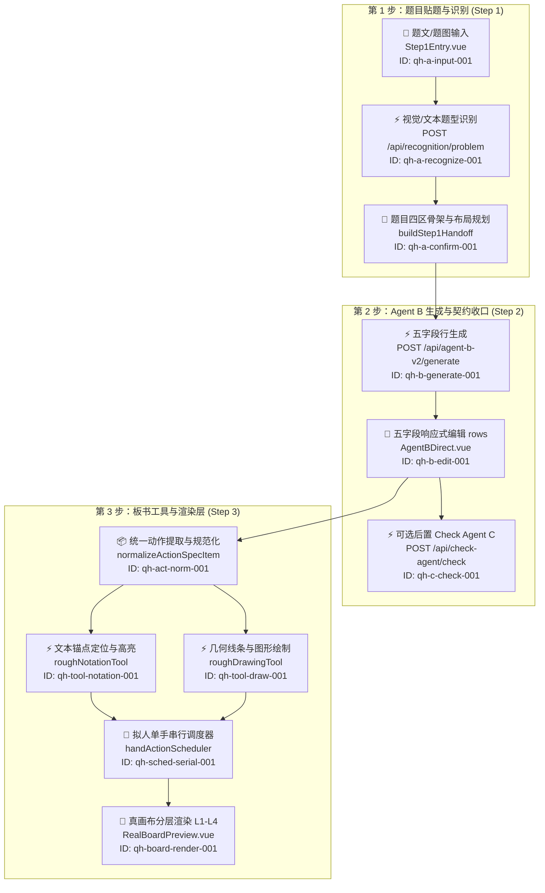

# 施工图与全局锚点索引 (Xiaxia Anchor Marking)

> **施工索引与回归入口，不是第二真相**。字段业务规则与合同以 `src/services/stepHandoff.js`、`src/agent-b-v2/contract.js` 及代码运行时为准。

## 一、主链路图谱与全局可搜索 ID

## 二、标准锚点对照表 (7层归属)

| 锚点 ID | 归属层级 | 接入类型 | 触发与代码文件 | 数据与接口绑定 | 边界与防崩兜底策略 |
|---|---|---|---|---|---|
| `qh-a-input-001` | event | `🔌` | `src/components/Step1Entry.vue` | 输入框 `problemText`、图片粘贴 | 图片读取异常时提供空态提示 |
| `qh-a-recognize-001` | api | `⚡` | `src/services/recognitionClient.js` | `POST /api/recognition/problem` | 模型识别异常自动回退纯文本流程 |
| `qh-a-confirm-001` | truth | `💾` | `src/services/stepHandoff.js` | `buildStep1Handoff` 产物 | 统一字号(30/35)、1726×980 唯一真源 |
| `qh-b-generate-001` | api | `⚡` | `src/agent-b-v2/service.js` | `POST /api/agent-b-v2/generate` | 纯文本 handoff 过滤传输，防超限 |
| `qh-b-edit-001` | state | `💾` | `src/agent-b-v2/AgentBDirect.vue` | 响应式 `rows` 五字段表 | 用户实时编辑作为最终交付真相 |
| `qh-c-check-001` | api | `⚡` | `src/check-agent/service.js` | `POST /api/check-agent/check` | 可选双眼，失败不破坏 A/B 结果 |
| `qh-act-norm-001` | state | `📦` | `src/components/RealBoardPreview.vue` | `actionSpec` 提取与归一化 | 过滤无效项与 capabilityGap |
| `qh-tool-notation-001` | ui | `⚡` | `src/board-tools/roughNotationTool.js` | `underline`, `circle`, `box` | 找不到目标文字时安全降级，不中断 |
| `qh-tool-draw-001` | ui | `⚡` | `src/board-tools/roughDrawingTool.js` | `rough-line`, `rough-arrow`, `draw` | 兼容 draw 意图并安全转换为真实绘制 |
| `qh-sched-serial-001` | event | `🔄` | `src/board-tools/handActionScheduler.js` | 单手串行、抬笔间隔、断点调度 | 隔离单步崩溃，保证后置动作平滑执行 |
| `qh-board-render-001` | ui | `🎨` | `src/components/RealBoardPreview.vue` | L1 底图、L2 固定四区、L3 生成层 | 1726×980 等比缩放，坐标防溢出 |
| `qh-font-link-001` | done | `✅` | `index.html <link onerror>` | ZeoSeven 490 字体 link 标签 + onerror 降级系统楷体 | 已上线，cdnLoader.js 已废弃删除 |
| `qh-loop-verify-001` | verify | `🔐` | `PROJECT_STATE.md` | `npm run check:proxy` 与实时热更 | 保证主链路纯净无阻断 |

## 三、锚点类型统计 (Xiaxia Anchor Stats)

- `⚡` API 与工具接入点：5 处
- `💾` 数据绑定与状态：3 处
- `🔌` 用户交互与事件：1 处
- `🔄` 实时与时序调度：1 处
- `📦` 数据转换与适配：1 处
- `🎨` 动态视图渲染：1 处
- `⚠️` 容错熔断与降级：1 处
- `🔐` 最小验证与红线：1 处
- **总计可搜索锚点**：14 处
