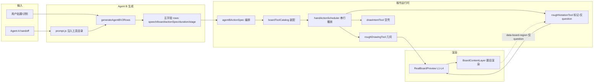

# 板书子系统 · 初始状态快照（阶段一交付物 3/3）

> refactor-discovery 阶段一产出。描述接手时板书子系统的真实状态、技术栈、可运行边界。
> 配套：`doc/board_resource_list.md`（资源清单）、`doc/board_risk_matrix.md`（风险矩阵）。

## 一、技术栈

| 维度 | 选型 | 说明 |
|---|---|---|
| 绘制框架 | rough.js（手绘感线/箭头/几何） | 已引入，未手搓 |
| 文本标记 | rough-notation（underline/highlight/circle/bracket） | 已引入 |
| 渲染 | Vue 3 SFC（BoardContentLayer / RealBoardPreview） | L1–L4 叠层 |
| 调度 | 自研 handActionScheduler（串行互斥 + 订阅） | 无外部依赖 |
| 字体 | 手写体（boardTypography 配置 + CSS 冻结） | 待独立播放器 |
| 坐标体系 | 画布百分比（0–100，左上原点）+ region 边界 | boardLayout / canvasCoords |

## 二、初始状态图（Mermaid）

## 三、四区（region）现状对齐表

| region | 有 boardPlan 坐标 | 有 DOM 锚点 | rough-drawing 可用 | rough-notation 可用 |
|---|---|---|---|---|
| question | ✅ | ✅（`BoardContentLayer:551`） | ✅ | ✅ |
| analysis | ✅ | ❌ | ✅（走 boardPlan bounds） | ❌（R1 崩） |
| solution | ✅ | ❌ | ✅ | ❌（R1 崩） |
| summary | ✅ | ❌ | ✅ | ❌（R1 崩） |

> 结论：几何绘制（rough-drawing）四区全通；文本标记（rough-notation）仅 question 通。两套区域表达（坐标对象 vs DOM 属性）未对齐是根因。

## 四、可运行边界（已验证 / 未验证）

- ✅ 主链：贴题 → 识别 → Agent B 生成 → 板书 L3 播放（question 区标记 + 四区几何）在本地 `bun run start` 跑通。
- ✅ 依赖闭包、构建、`check:proxy` 通过（见 PROJECT_STATE.md「已验证」）。
- ❌ 未用真实付费 API 做端到端自检（PROJECT_STATE「未验证」）。
- ❌ analysis/solution/summary 区 rough-notation 运行时抛错降级（本次 R1 新发现）。

## 五、阶段一结论

板书子系统**架构清晰、模块化隔离良好、核心绘制链路已跑通**，不是烂摊子。
唯一真实功能残缺是 **R1（三区文本标记不可用）**，属 P1 止血项；其余为 P2/P3 技术债与规划中能力。
**禁止大幅重构**：本次仅建议针对 R1 做最小修复（补 DOM 打标或 resolveRegion 回退），不搬动主链。
