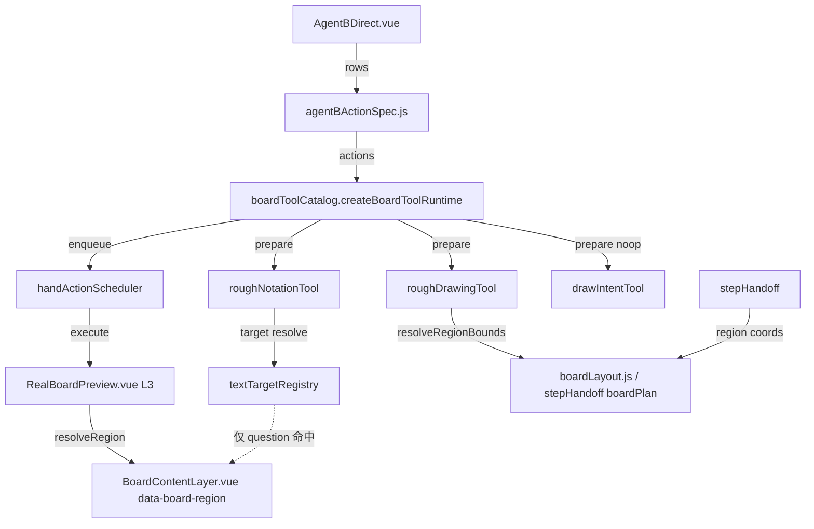

# 板书子系统 · 资源清单（阶段一交付物 1/3）

> 来源：refactor-discovery 阶段一 X-RAY 四层扫描。覆盖 `src/board-tools/`、`src/components/`、`src/services/`、`src/utils/` 中与板书相关的模块。
> 核验日期：2026 勘察轮次。所有结论均基于真实代码读取（verified code is truth）。

## 一、核心模块清单（按职责分层）

### 1.1 绘制引擎层 `src/board-tools/`

| 文件 | 职责 | 关键导出 | 复用评级 |
|---|---|---|---|
| `roughDrawingTool.js` | rough.js 画线/箭头/几何图形引擎；区域边界越界校验 | `getRoughDrawingAgentTools` / `prepareRoughDrawingAction` / `validateRoughDrawingRegion` / `ROUGH_DRAWING_REGIONS` | 核心，已跑通 |
| `roughNotationTool.js` | rough-notation 文本标记（underline/highlight/circle/bracket）；依赖文本目标定位 | `getRoughNotationAgentTool` / `prepareRoughNotationAction` / `validateRoughNotationAction` | 核心，**仅 question 区可用**（见风险 R1） |
| `handActionScheduler.js` | 手部动作串行调度器：互斥锁 + 订阅/状态机，保证板书动作顺序播放 | `createHandActionScheduler` | 核心，已跑通 |
| `boardToolCatalog.js` | 工具目录（Agent 可见 schema）+ 运行时 prepare/enqueue；唯一装配点 | `getAgentBoardToolCatalog` / `createBoardToolRuntime` / `validateBoardToolAction` | 核心装配点 |
| `boardToolTiming.js` | 时序控制与 seed（确定性播放，避免字体/坐标漂移） | 时序/seed 工具 | 核心，全程序控制 |
| `textTargetRegistry.js` | 文本标记目标注册：按 `region + exactText + occurrence` 定位 DOM 锚点 | `createTextTargetRegistry` / `VALID_REGIONS` | 核心支撑 |
| `drawIntentTool.js` | draw 意图工具：schema + 校验 | `getDrawIntentAgentTool` / `validateDrawIntentAction` / `DRAW_INTENT_TOOL_ID` | **执行路径死重**（见风险 R2） |
| `boardTypography.js` | 字体配置 + 手写范围断言（`assertHandwritingScope`） | 字体加载 / 范围校验 | 已冻结待独立播放器 |
| `boardTypography.css` | 字体 CSS（冻结） | — | 静态资源 |

### 1.2 渲染层 `src/components/`

| 文件 | 职责 | 关键导出 | 复用评级 |
|---|---|---|---|
| `RealBoardPreview.vue` | L1–L4 叠层编排 + 坐标调试 + L3 播放插槽；提供 `resolveRegion` / `resolveRegionBounds` / `resolveCanvas` | 组件 | 核心编排 |
| `BoardContentLayer.vue` | L2 唯一渲染边界：题目/标签/区域引导/网格/题块测量；**唯一打 `data-board-region="question"` 的节点** | 组件 | 核心渲染 |

### 1.3 编排与策略层 `src/services/`

| 文件 | 职责 | 复用评级 |
|---|---|---|
| `agentBActionSpec.js` | Agent B action 编排（把生成 rows 映射到板书动作） | 核心 |
| `stepHandoff.js` | 第 1 步确认数据构建 + 区域坐标（analysis/solution/summary 均有 boardPlan 坐标） | 核心 |
| `boardMathPolicy.js` | 板书数学软校验 | 支撑 |
| `speechTiming.js` | 口播时序 | 支撑 |

### 1.4 布局与坐标 `src/utils/`

| 文件 | 职责 | 复用评级 |
|---|---|---|
| `boardLayout.js` | 四区标签规划（question/analysis/solution/summary 百分比布局） | 核心 |
| `canvasCoords.js` | Agent B 画布固定坐标 | 核心 |

## 二、可复用资源初筛

- ✅ **rough.js + rough-notation 双库组合**：已是成熟库，未手搓绘制框架，符合「禁止盲目手搓」铁律。
- ✅ **handActionScheduler 串行互斥**：可复用于任何「按序播放动作」场景（口播/板书/高亮联动）。
- ✅ **boardToolCatalog 装配点**：新增板书工具只需在此注册 + 实现 `prepare`，无需改渲染层，模块化隔离良好。
- ⚠️ **drawIntentTool**：schema/校验已存在，但 `createBoardToolRuntime.prepare` 给它的 `execute` 是空函数 → 同 `roughDrawingTool` 能力重叠且执行空转，属可清理的死重（不影响主链，单独提出）。
- ⚠️ **boardMathPolicy / speechTiming**：策略层与板书播放耦合度低，可下沉为公共工具复用。

## 三、依赖边（执行主链，Mermaid）

> 红色虚线即风险 R1：textTargetRegistry 经 `resolveRegion` 查 DOM，而 `BoardContentLayer` 只对 question 打标，analysis/solution/summary 必 miss。
