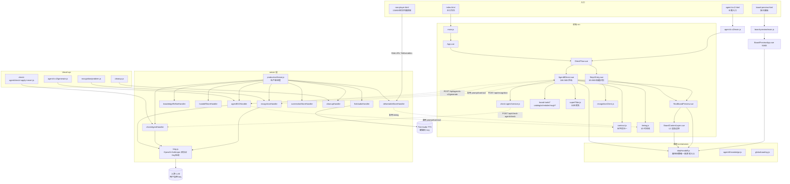

# 初始状态快照（refactor-discovery · 2026-09-22）

> 0 置信度重扫。本文件是后续所有阶段的基线；任何主链删除/改名/路由变更必须同步更新此文件。

## 一、身份与范围

| 项 | 值 |
|---|---|
| 项目名 | teaching-board（package.json:2） |
| 版本 | 1.0.0（package.json:5） |
| 描述 | 小学数学讲题视频生成工作台（package.json:6） |
| 仓库根 | `G:\vedio\2222-feat-all-tasks-complete` |
| 模式 | ESM（package.json:5 `"type": "module"`） |
| 已读范围 | src/ 全部 .js/.vue、server/ 全部 .js、api/ 全部、vite.config.js、index.html、package.json、根目录主要 .md |
| 未读范围 | row-player.html 仅头部 30 行（134 KB 单文件，按合同消费方定位）；doc/ 教学文档未逐行；AgentBDirect.vue 未逐行（186.5 KB）；skills/* 仅列 SKILL.md |
| revision | 工作区当前状态（无 git 命令，未确认 commit） |

## 二、证据矩阵（current-fact 登记）

| # | 主张 | locator | confirmed/inferred |
|---|---|---|---|
| E1 | 三入口构建：main / board-preview / agent-b-v2 | vite.config.js:96-101 | confirmed |
| E2 | 9 个 server plugin + 1 内联 health/mock | vite.config.js:70-82, 33-67 | confirmed |
| E3 | 主链 main.js→App.vue→DirectFlow→Step1Entry→AgentBDirect | src/main.js:17, App.vue:3, DirectFlow.vue, PROJECT_STATE:32-41 | confirmed |
| E4 | server/ 复用 src/ 的 prompt/contract/timing | server/agentBV2Handler.js:1-7, deliverableStoreHandler.js | confirmed |
| E5 | 无循环依赖 | 本轮 import 边全量提取 | inferred（基于相对 import 静态扫描，运行时动态 require 未覆盖） |
| E6 | stepHandoff.js 扇入 11，是中心枢纽 | 本轮边扫描 | confirmed |
| E7 | 画布 1726×980，题 30px，板 38px，主字体 507 | stepHandoff.js:19-59 | confirmed |
| E8 | 160cpm + 1.5s row gap + 400ms/字 | timing.js:2-5 | confirmed |
| E9 | 五字段 stage/speech/board/actionSpec | contract.js:4-9 | confirmed |
| E10 | superFilter 10 步流水线唯一真源 | superFilter.js:77-114 | confirmed |
| E11 | Fish Audio API Key 硬编码 | fishAudioHandler.js:12-17 | confirmed |
| E12 | scripts/scripts/ 与外层哈希相同 | 本轮 Get-FileHash | confirmed |
| E13 | B 不输出时间字段，下游 timing.js 算 | timing.js:117-252, DECISIONS 2026-08-21 | confirmed |
| E14 | A/B/C 三 agent 配置独立，互不迁移 | lib/userApiConfig.js, checkAgentApiConfig.js, agentBApiConfig.js | confirmed（PROJECT_STATE 声明，未逐行读 storage key） |
| E15 | handoff 只传文本字段，不传图/Base64 | AGENTS.md:96-97, HANDOFF_TEXT_FIELDS in agentBV2Handler | confirmed |
| E16 | row-player.html 吃 deliverable JSON，音频为主时钟 | row-player.html 头注释 | confirmed |
| E17 | 生产单进程 Node + public/ 持久化卷 | DECISIONS 2026-09-13, productionServer.js | confirmed |
| E18 | Vite 已移除 CDN external，vendor 本地打包 | vite.config.js:18-31, 102 | confirmed |

## 三、Mermaid 初始状态图



## 四、四区对齐表（stepHandoff.js 唯一真源）

| 区 | key | 字体 | 字号 | 颜色 | 行高 | 落板时机 |
|---|---|---|---|---|---|---|
| 题目 | question | 印刷体（Segoe UI/PingFang/YaHei） | 30px | 黑 | 1.65 固定 | 一打开就写好（考卷式） |
| 分析 | analysis | 手写体 507 平方乔木体 | 38px | 红 | 1.7±随机(1.55~1.85) | 随 row 时间线落笔 |
| 解答 | solution | 同上 | 38px | 黑 | 同上 | 同上 |
| 总结 | summary | 同上 | 38px | 黑 | 同上 | 同上 |

画布：1726×980 px，百分比坐标 0-100。板书速度 2.5 字/s ±5% 抖动，超音频窗口自适应加速。

## 五、文档六维研读

| 维度 | 状态 | 证据 |
|---|---|---|
| README | ✅ 有，较新（含测试/部署/项目结构） | README.md |
| API 文档 | ✅ 部分 | doc/DELIVERABLE_API_SPEC.md（0 KB，疑似空文件或软链）；HANDOFF_API_SPEC.md 未在 doc/ 根见到 |
| 贡献指南 | ❌ 缺失 | 无 CONTRIBUTING.md |
| CHANGELOG | ✅ 有（1.0.0 - 2026-09-20） | CHANGELOG.md |
| 测试文档 | ⚠️ 仅脚本，无 TESTING.md | scripts/*.mjs + package.json scripts |
| 架构文档 | ⚠️ 薄 | ARCHITECTURE.md 22 行；SYSTEM_MAP.md / XRAY-全局图谱.md / minimal-runtime-loop.md 补充 |

## 六、规模

```
src+server+api 总代码行：20,597
  src/agent-b-v2      5,891（含 AgentBDirect.vue ~5000 行）
  src/components      4,705
  server              3,322
  src/board-preview   1,799
  src/board-tools     1,133
  src/lib             1,101
  src/utils             669
  src/check-agent       618
  src/services          614
  api                    28
row-player.html      134 KB（单文件，未计入上述行）
```

## 七、与上轮文档的差异（0 置信度核验结论）

| 上轮说法 | 本轮代码核验 |
|---|---|
| PROJECT_STATE 称 9 个 API handler | ✅ 一致（vite.config.js 9 plugin） |
| README 称 7 个 skill | ❌ 实际 8 个（多了 board-speech-rules） |
| SYSTEM_MAP 称沙箱 /home/z/my-project | ❌ 已过期，当前路径 G:\vedio\... |
| PROJECT_STATE 称 Agent A 知识库 doc/knowledge-list.md | ⚠️ knowledge-list.md 仅 0.2 KB，真正在用的是 knowledge-a.compact.json 136.8 KB + knowledge_points.json 240.9 KB |
| 字体主 490（用户偏好记录） | ❌ 代码现状 Task 10 已改为 507 主、490 降级（stepHandoff.js:26-51） |
| 上轮 board_* 三件套（doc/board_*.md） | ✅ 仍在，本轮产出 discovery-2026-09-22-*.md 与其并行，不覆盖 |

## 八、会改变结论的未知与最小验证动作

1. **E5 无循环依赖**：仅静态相对 import 扫描。若存在动态 `import()` 或 `require(variable)`，需跑 `codegraph` 或 madge 二次确认。最小动作：`npx madge --circular src/main.js`。
2. **AgentBDirect.vue 内部**：186.5 KB 未逐行读，R4 巨石拆分需进入阶段二再下钻。
3. **row-player.html**：134 KB 仅读头部，其 superFilter 副本是否与 src/utils/superFilter.js 已漂移未确认（superFilter.js 注释称"从 row-player.html L648-716 抽出"）。最小动作：diff 两份过滤逻辑。
4. **已运行验证**：本轮为只读勘探，未跑 `npm run build` / `npm run check:proxy`。PROJECT_STATE 声称构建通过，但本轮未复核。
5. **git 状态**：未执行 git 命令，工作区是否干净、当前分支与 `2222-feat-all-tasks-complete` 名字的关系未确认。
