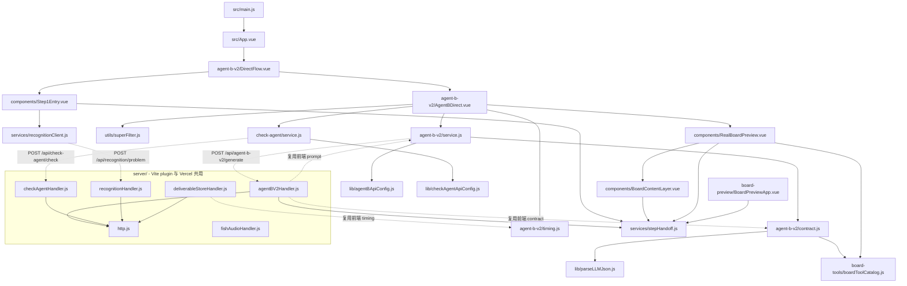

# 可复用资源清单（refactor-discovery · 2026-09-22）

> 0 置信度重扫，全部经真实代码核验。路径相对仓库根 `G:\vedio\2222-feat-all-tasks-complete`。
> 本表服务于 reuse-first-guard：动手前先查这里，禁止重复造轮子。

## 一、技术栈一句话

Vue 3.5.39 + Vite 8.1.1（本地打包，无 CDN external）+ Ant Design Vue 4.2.6 + KaTeX 0.18.4 + rough-notation 0.5.1 + roughjs 4.6.6；ESM；生产单进程 `server/productionServer.js`，本地 dev 走 Vite middleware 插件，Vercel 走 `api/*.js` thin wrapper 复用同一份 handler。

## 二、唯一真源 / 公共模块（直接 import，禁止重写）

| 路径 | 职责 | 扇入 | 复用要点 |
|---|---|---|---|
| `src/services/stepHandoff.js` | 画布参数唯一真源：1726×980、题 30px、板 38px、字体栈、行高 1.7±随机、速度 2.5字/s | 11 | `CANVAS_SIZE / BOARD_FONT_SIZE / HANDWRITING_FONT_STACK / buildCanvasParams()`，别处禁止写字面值 |
| `src/lib/parseLLMJson.js` | 5 级容错 JSON 解析 | 6 | 6 处手搓 parser 已合并；任何 LLM JSON 输出都走这里 |
| `src/utils/superFilter.js` | 板书 10 步清洗（LaTeX→Unicode / 缺字降级 / 除号→\frac） | 3 | `normalizeBoardLine / toBoardLines / isStructMath`，顺序不可倒 |
| `src/agent-b-v2/timing.js` | 160cpm + 1D 单手串行时间线 | 3 | `countCharacters / estimateSpeechDurationMs / computeRowGroupTimeline / applyAgentBV2Timeline`，字数算法唯一真源 |
| `src/agent-b-v2/contract.js` | 五字段归一（stage 同义词吸附 / board 双兼容 / 弃用字段检测） | 5 | `parseAgentBV2Response / normalizeBoard / collectDeprecationWarnings` |
| `server/http.js` | 上游 LLM 请求双协议（OpenAI / Anthropic）+ Key 轮询 + 401/403/408/429/5xx 重试 | 7 | `requestChatCompletion / requestAnthropicMessage / resolveUserCredentials / sendJson / readJsonBody` |
| `src/board-tools/stableHash.js` | FNV-1a 32-bit hash | 2 | 两处已合并 |
| `src/board-tools/boardToolCatalog.js` | 板书工具白名单 + `validateBoardToolAction` | 4 | 动作合法性唯一校验入口 |
| `src/check-agent/skillViolations.js` | 5 技能红线审计（不阻断，进 changes 报告） | 1 | `auditRowsBySkills` |
| `src/lib/mathAsrConverter.js` | 数学数字 → 中文发音（ASR 润色用） | 2 | Check Agent C 专用 |
| `src/check-agent/asrPolish.js` | ASR 润色流水线 | 2 | 依赖 mathAsrConverter |

## 三、主链组件（不可删，PROJECT_STATE 已列，本轮复核一致）

```
src/main.js → src/App.vue → src/agent-b-v2/DirectFlow.vue
  → src/components/Step1Entry.vue（贴题识别，69.8 KB）
  → src/agent-b-v2/AgentBDirect.vue（B 页，186.5 KB，巨石）
  → src/components/RealBoardPreview.vue（L1-L4 叠层）
  → src/components/BoardContentLayer.vue（L2 唯一渲染边界）
```

## 四、server 端 9 个 plugin（vite.config.js 挂载顺序即注册顺序）

| Plugin | 路由 | 文件 |
|---|---|---|
| createRecognitionProxyPlugin | POST /api/recognition/problem | server/recognitionHandler.js |
| agentBV2ProxyPlugin | POST /api/agent-b-v2/generate | server/agentBV2Handler.js |
| checkAgentProxyPlugin | POST /api/check-agent/check + /apply + /revert | server/checkAgentHandler.js |
| knowledgeRefinePlugin | POST /api/knowledge/refine + /revert | server/knowledgeRefineHandler.js |
| handoffStorePlugin | GET/POST /api/handoff | server/handoffStoreHandler.js |
| screenshotStorePlugin | POST /api/screenshot | server/screenshotStoreHandler.js |
| deliverableStorePlugin | GET/POST /api/deliverable | server/deliverableStoreHandler.js |
| fishAudioPlugin | POST /api/fish-audio/* | server/fishAudioHandler.js |
| cleanupPlugin | POST /api/cleanup | server/cleanupHandler.js |
| healthAndMockPlugin（内联） | GET /api/health, /api/mock/problem | vite.config.js:33 |

## 五、独立入口（vite build.rollupOptions.input 三入口）

| HTML | JS 入口 | 用途 |
|---|---|---|
| `index.html` | src/main.js → App.vue → DirectFlow | 主工作台 |
| `board-preview.html` | src/board-preview/main.js → BoardPreviewApp.vue (56 KB) | 独立画板预览 |
| `agent-b-v2.html` | src/agent-b-v2/main.js → DirectFlow | B 页裸入口（与主入口重复，疑似遗留） |
| `row-player.html`（根目录，134 KB） | 无外部 JS，零依赖单文件 | 演播播放器，吃 deliverable JSON |
| `agent-b-v2.html` / `board-preview.html`（根目录） | 壳页 | 已存在 |

## 六、Skill 沉淀（skills/，实际 8 个 SKILL.md，非 README 说的 7 个）

1. board-zone-layout — 四区 1726×980 坐标
2. handwriting-font-policy — 字体策略
3. hand-action-control — 3 工具白名单 + 互斥
4. speech-board-timing — 160cpm + 400ms/字
5. field-char-escape-filter — superFilter 10 步
6. board-lecture-player — 音频时钟 + occupancy map
7. blingbling小眼睛 — DOM-first 观察
8. board-speech-rules — 口播规则（README 未列）

可交互 demo 在 `public/skills-hub/`。

## 七、文档资产（doc/，教学内容核心资产，禁删）

- `doc/speech-board-guide.md` (20.9 KB) — 口播板书规则
- `doc/self-check.md` (8.3 KB) — Check Agent C 润色规则
- `doc/建议提示.md` (11.1 KB) — B prompt 教学源
- `doc/XRAY-全局图谱.md` (20.3 KB) — 上轮 X-RAY
- `doc/minimal-runtime-loop.md` (5.1 KB) — 施工索引
- `doc/knowledge-a.compact.json` (136.8 KB) + `doc/knowledge_points.json` (240.9 KB) — 知识库快照
- `doc/DELIVERABLE_API_SPEC.md` — 交付物合同

## 八、测试脚本（可直接跑）

- `node scripts/run-all-tests.mjs` — 全量
- `node scripts/test-parseLLMJson.mjs` — 16 用例
- `node scripts/test-timing-computeRowGroup.mjs` — 7 用例 + 6 不变量
- `node scripts/test-timing-fix.mjs` — 5 用例
- `node scripts/smoke-test-skills.mjs` — 11 用例
- `node skills/board-lecture-player/scripts/validate_contract.cjs` — 合同校验
- `npm run check:proxy` — 代理回归自检

## 九、依赖边 Mermaid（精简，只画跨模块主干）



**循环依赖**：未发现。`stepHandoff.js` 是扇入 11 的中心枢纽，但自身只依赖 `doc/knowledge-a.compact.json`，无反向边，属健康枢纽。
