# 最小可运行闭环 · 动态代码图谱

> 施工索引，不是第二业务真相。代码与合同冲突时，以当前代码和 `PROJECT_STATE.md` 为准，并更新本图。

## 一眼看懂

```mermaid
flowchart LR
    U["🔌 用户输入题目/题图<br/>Step1Entry.vue<br/>ID: qh-a-input-001"]
    A["⚡ Agent A 识别<br/>POST /api/recognition/problem<br/>ID: qh-a-recognize-001"]
    C1{"⚠️ 识别成功?"}
    P["💾 用户确认题型/侧重/布局<br/>buildStep1Handoff<br/>ID: qh-a-confirm-001"]
    B["⚡ Agent B 生成五字段<br/>POST /api/agent-b-v2/generate<br/>ID: qh-b-generate-001"]
    E["💾 五字段可编辑真相<br/>AgentBDirect rows<br/>ID: qh-b-edit-001"]
    C["⚡ 可选 Check Agent C<br/>POST /api/check-agent/check<br/>ID: qh-c-check-001"]
    C2{"⚠️ C 可用且通过?"}
    R["📦 当前 rows<br/>speech / board / actionSpec<br/>ID: qh-b-rows-001"]
    V["🎨 真实板书预览<br/>RealBoardPreview → BoardContentLayer<br/>ID: qh-board-render-001"]
    O["✅ 最小闭环输出<br/>可编辑脚本 + 板书预览<br/>ID: qh-loop-done-001"]

    U --> A
    A --> C1
    C1 -- 是 --> P
    C1 -- 否：保留文本/知识回退 --> P
    P --> B
    B --> E
    E --> C
    E --> R
    C --> C2
    C2 -- 是：仅修正三字段 --> R
    C2 -- 否/未配置/未点击 --> R
    R --> V
    V --> O
```



## 真实调用链

| 锚点 | 层级 | 触发与代码位置 | 状态/API | 失败与边界 |
|---|---|---|---|---|
| `qh-app-entry-001` | ui | `src/main.js → src/App.vue → src/agent-b-v2/DirectFlow.vue` | 页面只在 `step1 / agent-b` 间切换 | 主入口禁止分叉 |
| `qh-a-input-001` | event | `src/components/Step1Entry.vue` 输入文字或图片 | `problemText / sourceImageDataUrl` | 图片读取失败给用户提示 |
| `qh-a-recognize-001` | api | `recognitionClient.js → /api/recognition/problem → recognitionHandler.js` | A/B 共用用户 endpoint/model/apiKey | 识别失败不能阻断用户继续确认 |
| `qh-a-confirm-001` | truth | `Step1Entry.confirmStep1 → buildStep1Handoff → DirectFlow memory` | 题目、题型、侧重、知识、布局、坐标 | 只缺非必要参考时允许继续 |
| `qh-b-generate-001` | api | `AgentBDirect.generateRows → service.js → /api/agent-b-v2/generate → agentBV2Handler.js` | 返回五字段 rows | 生成合同只卡最低可协作格式 |
| `qh-b-edit-001` | state | `AgentBDirect.vue` 页面内存 | 用户当前 rows 是后续审计真相 | 不写 localStorage/IndexedDB |
| `qh-c-check-001` | api | `check-agent/service.js → /api/check-agent/check → checkAgentHandler.js` | C 使用独立 endpoint/model/apiKey | 可选插件，失败不得破坏 A/B |
| `qh-c-scope-001` | risk | `check-agent/contract.js` | 只改 `speech / board / actionSpec` | 不改步骤数、顺序、时长、阶段、备注 |
| `qh-board-render-001` | ui | `RealBoardPreview.vue → BoardContentLayer.vue` | L1 底图、L2 固定内容、L3 生成层、L4 用户层 | 当前闭环只要求可见预览，不宣称完整播放 |
| `qh-loop-verify-001` | verify | `npm run build && npm run check:proxy` | 构建 + 三 API 代理边界 | 任一失败即闭环受损 |

## 保护边界

以下路径共同构成最小可运行闭环。删除、改名、换路由或改变合同前，必须先更新本图并通过 `qh-loop-verify-001`：

```text
src/main.js
src/App.vue
src/agent-b-v2/DirectFlow.vue
src/components/Step1Entry.vue
src/services/recognitionClient.js
src/services/stepHandoff.js
server/agentAKnowledge.js
server/recognitionPrompt.js
server/docReferences.js
doc/knowledge-a.compact.json
src/agent-b-v2/AgentBDirect.vue
src/agent-b-v2/service.js
src/agent-b-v2/contract.js
src/components/RealBoardPreview.vue
src/components/BoardContentLayer.vue
src/check-agent/service.js
src/check-agent/contract.js
server/recognitionHandler.js
server/agentBV2Handler.js
server/checkAgentHandler.js
api/recognition/problem.js
api/agent-b-v2/generate.js
api/check-agent/check.js
vite.config.js
vercel.json
```

## 当前能力边界

- **已闭环**：题目输入/识别、用户确认、B 五字段生成、用户编辑、可选 C 检查、真实板书预览。
- **不是闭环门槛**：C 未配置或失败时，A/B 必须照常完成。
- **尚未宣称完成**：完整板书预排版、逐步骤遮罩揭示、稳定动作播放、L4 用户画笔。
- **当前持久化**：A/B 配置与 C 配置分别存于 localStorage；生成 rows 只在页面内存。
- **Agent A 知识输入**：文本题由服务端 Top-K 注入，图片题使用紧凑 ID 目录；禁止恢复为每次全量注入知识文件。

## 最小回归

1. `npm run build` 成功。`ID: qh-loop-build-001`
2. `npm run check:proxy` 输出 `proxy self-check ok`。`ID: qh-loop-proxy-001`
3. `npm run check:knowledge` 输出 `agent A knowledge self-check ok`。`ID: qh-loop-knowledge-001`
4. 无 C 配置时仍可从确认页进入 B 并生成。`ID: qh-loop-c-optional-001`
5. C 仅改变三种允许字段，失败时保留点击前 rows。`ID: qh-loop-c-scope-001`
6. 板书预览仍显示题目、四区和当前 rows 对应内容。`ID: qh-loop-board-001`

## 锚点统计

- truth: 1
- ui: 3
- api: 3
- state: 1
- event: 1
- risk: 1
- verify: 7
- 总计: 17
