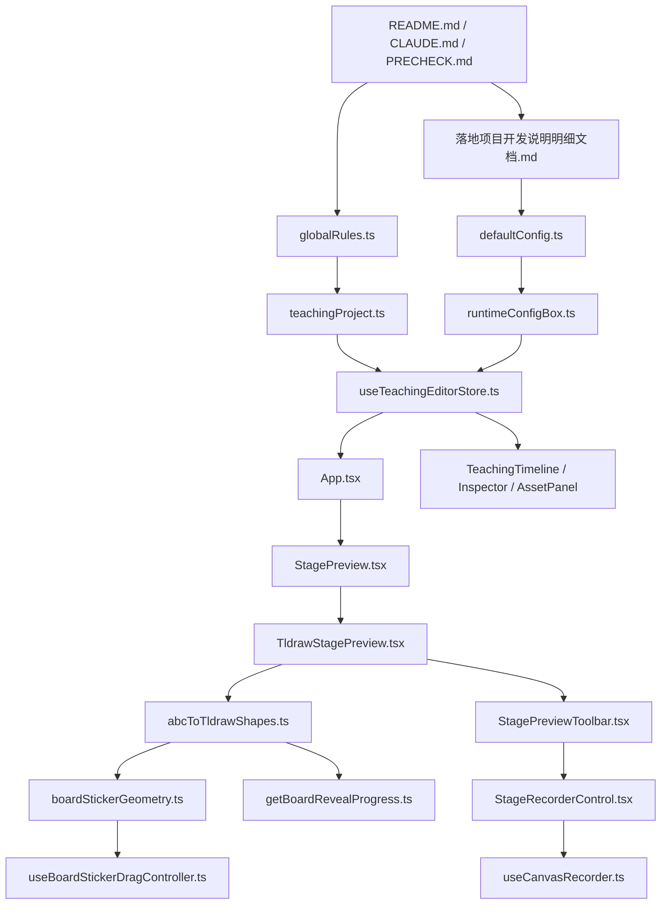

# 当前项目全局认知图与批注说明

> 性质：批注层 / 认知图说明 / 迁移与重构阅读入口
> 规则：**不改原始说明文档的正文真相，只在这里补充解释、关联、引用和当前判断。**
>
> 建议阅读顺序：`README.md` → `CLAUDE.md` → `PRECHECK.md` → `src/domain/globalRules.ts` → `src/domain/teachingProject.ts` → `src/config/defaultConfig.ts` → `src/store/useTeachingEditorStore.ts` → `src/components/StagePreview.tsx`

---

## 日期批注横表

| 记录项 | 2026-05-30 当前 |
| --- | --- |
| 状态 | 当前生效 |
| 当前真相文件 | `README.md` / `CLAUDE.md` / `PRECHECK.md` / `src/domain/globalRules.ts` / `src/domain/teachingProject.ts` / `src/config/defaultConfig.ts` / `src/store/useTeachingEditorStore.ts` |
| 仍然有效 | 项目本质是**教学自动剪辑 / 讲课板书录制工作台**，不是普通白板；优先成熟框架，不扩散自写运行时；A/B/C 仍是唯一业务分层口径。 |
| 已被覆盖 | 旧时期“tldraw 作为统一底座且不轻易动”的口径，正在被“为 Agent 自动板书与录屏主线重构舞台层”重新评估。 |
| 为什么变化 | 当前主线已经明确转向：用户上传题目 → Agent 自动生成板书 → 画笔控制 → 教学录屏输出。这个方向要求舞台层更可程序化控制，而不应继续被重编辑器状态机绑死。 |
| 下一步 | 在不丢功能、不松契约的前提下，评估并实施 `TldrawStagePreview -> KonvaStagePreview` 的最小替换路线。 |

---

## 0. 当前真相入口（新增总路牌）

如果读者只看一处来判断“现在该按什么口径继续施工”，请优先看：
1. `当前项目全局认知图与批注说明.md` —— 当前真相总路牌与批注层
2. `src/domain/globalRules.ts` —— 规则真相（A/B/C、section、边界、写入责任）
3. `src/domain/teachingProject.ts` —— 数据结构真相
4. `src/config/defaultConfig.ts` + `src/config/runtimeConfigBox.ts` —— 统一配置中心与读口
5. `src/store/useTeachingEditorStore.ts` —— 状态与动作真相
6. `src/components/StagePreview.tsx` —— 当前正式舞台公共入口
7. `src/standalone/KonvaProofPage.tsx` —— 第四步内容层 proof 路径

批注：
- 旧说明文档仍保留为历史足迹，但不应再单独承担“当前施工方向盘”的角色。
- 特别是涉及 `tldraw-first`、高分屏默认、响应式假设、旧舞台承载方式的片段，必须结合各文件顶部批注与本文件当前状态判断。

---

## 1. 这份批注解决什么问题

当前仓库的信息很多，但分散在：
- 根目录说明文档
- `src/domain` 的规则与类型真相
- `src/config` 的运行参数
- `src/store` 的状态与动作
- `src/components` 的 UI 入口
- `src/modules` 的局部能力说明

如果不做一层“关系图式解释”，很容易出现以下问题：
1. 把根说明文档当成架构真相，但真正字段写在 `domain` / `store`。
2. 把组件层的当前实现当成长期边界，而忽略 `globalRules.ts` 已经定义的唯一口径。
3. 做画布迁移时误以为要大规模重写，实际上大部分业务骨架可以复用。

本文件的作用就是把这些东西串起来，形成一个**立体的认知入口**。

---

## 2. 文档分层：哪些是“方向真相”，哪些是“施工图纸”

### 2.1 根目录文档

#### `README.md`
- 作用：仓库的**总边界说明**。
- 当前最重要的信息：
  - 这里是唯一施工目录。
  - 旧仓只能先理解再重建，不能直接混用代码。
  - 优先成熟框架，禁止继续扩散自写运行时。
- 批注：这是**总原则入口**，不是字段级真相。

#### `CLAUDE.md`
- 作用：项目级施工规则。
- 当前最重要的信息：
  - 旧仓参考顺序
  - 禁止同时维护多套舞台主实现
  - 项目本质是教学自动剪辑 / 讲课板书录制工作台
  - 第四步播放 / 录制舞台应优先走成熟框架承载
- 批注：这是**架构方向与边界约束文件**，对“是否该迁画布框架”有很高权重。

#### `PRECHECK.md`
- 作用：开工前约束。
- 当前最重要的信息：
  - 先定结构，再写代码
  - 每步只做一件事
  - 每步都要有“目标 + 验收点”
  - 只走成熟框架，不扩散自写运行时
- 批注：这是**节奏控制文件**，确保重构不会失控。

### 2.2 PC 工作台与低分辨率约束（新增硬约束）

这个产品是**学校电脑上的 PC 工作台**，不是响应式消费端页面。后续 UI 壳层和舞台布局必须遵守以下约束：

1. **不做响应式优先思路**
   - 目标不是手机 / 平板 / 任意断点适配
   - 目标是低分辨率学校 PC 可用、稳、清楚、不断裂
2. **不是所有设备都支持 1080 / 2K / 4K**
   - 设计和布局不能默认用户有高分辨率大屏
   - 必须优先考虑更低分辨率下“整个工作台仍然能看、能点、能操作”
3. **可以借鉴质谱 AI 那种更清秀、更照顾中小屏幕的壳层思路**
   - 但不能照搬它的内容定义与流程逻辑
   - 只能借它对中小屏幕更友好的结构意识
4. **这是工作台，不是演示页**
   - 要接地气
   - 重点是可操作、可辨识、可持续使用
   - 不为了视觉感而牺牲低分辨率可用性

批注：
- 这条约束会直接影响左中右三栏的比例、按钮尺寸、工具区密度、状态区布局、舞台最小可视尺寸。
- “不响应式”不等于“只管高分屏”，而是**固定 PC 工作台逻辑，但优先服务低分辨率学校电脑**。
- 后续所有壳层重构都应先问：在更低分辨率下，这一屏还能不能完整看清和操作？

### 2.3 第四步重构硬约束（新增总钉子）

#### 产品转型目标（写死）
本项目不是普通白板，而是**高仿在线直播板书解题 / 板书教学 / 教学录屏工作台**。并且它本质上是一个**自动化工作流 / 多 agent 协作产品**：用户上传题目 → 自动生成讲解与板书 → 控制播放 / 板书 / 标注 → 录屏交付。

#### 重构边界（写死）
- 第一到第三步当前主链保持不动：上传识别、自动生成、当前流程不回头重做。
- 第二步已经产出四区标签、画布参数、板书内容来源等上游真相。
- 本轮只重构第四步：**舞台承载 / 播放 / 录制层**；不回头打散前 1~3 步。

#### 第四步职责（写死）
第四步只能做：**消费、映射、渲染、录制** 上游真相，不能重新发明语义。
- 四区语义固定：`题目 / 分析 / 解答 / 总结`
- 上游真相来源固定：`section` / `groupKey` / `problemText.summary` / `boardSlice` / `TimelineClip`
- 一句话：**第二步是参数生产层，第四步是舞台消费层。**

#### 技术取向（写死）
- 优先成熟框架承载，不继续扩散手搓舞台运行时。
- `Konva / canvas` 负责可录制舞台内容；`DOM` 负责交互壳层。
-(这里开始飘了——>什么是chrome？的定义？开始自己造内容了。。。。) 凡是必须录进去的 chrome，都必须有 canvas 同源表达。
- 目标不是再做一套新语义，而是让现有真相能被多个承载稳定消费。

#### 视觉与交互护栏（写死）
- 这是学校低分辨率 PC 工作台，不是响应式消费页。
- 优先低分辨率可用性、稳定性、清晰度。
- 舞台内必须区分：
  - **（批注：我们已经有了清晰的映射，不应该自己再造概念的）系统字体 chrome**：标签、题目区、结构提示
  - **手写 C 层内容**：板书演绎内容

#### 明确禁止（写死）
- 不重做前三步主链。
- 不让第四步反向定义业务语义。
- 不引入 `zone`、共享模型等新概念包装。
- 不让 `tldraw` 遗留路径继续拥有主舞台判断权。

批注：
- 当前正式主舞台路径见 `src/components/StagePreview.tsx` 与 `src/components/LegacyStagePreview.tsx`。
- `src/standalone/KonvaProofPage.tsx` 是目标验证线；`src/components/TldrawStagePreview.tsx` / `src/modules/tldrawStage/abcToTldrawShapes.ts` 是遗留退场线。
- 这条硬约束的目的不是“整理文档”，而是防止第四步继续漂移和继续制造第二套真相。

---

#### `落地项目开发说明明细文档.md`
- 作用：偏产品/工程要求说明，解释“为什么要做某功能”。
- 批注：这里包含很多仍然有效的业务约束，如“只舞台录制、不录壳层”“整版板书预览是临时态”等。

#### `落地项目开发说明明细文档-代码直敲版.md`
- 作用：偏实现施工图。
- 批注：是当前最像“工程蓝图”的文件，适合落地时对照，但要注意其中某些口径仍带有 `tldraw` 时代的实现假设，后续需要保留历史足迹并持续批注，而不是直接伪装成从一开始就支持 Konva。

---

## 3. 当前项目的“唯一真相源”分布

### 3.1 规则真相：`src/domain/globalRules.ts`

这是当前项目最重要的**跨模块规则源**之一，负责定义：
- A/B/C 的身份边界
- Script section 与 chain key 规则
- 时间线轨道与 clip 类型
- 资产类型与状态
- LocalStorage key
- 组件边界
- 第三步到第四步转换边界
- C 视觉字段的写入责任
- z-index 叠放规则

### 当前必须认住的全局常量

#### A/B/C 业务层口径
- `ABC_TRACK_IDENTITY`
- `ABC_INTERPLAY_RULES`

批注：
- **A 轨**：语音主轴，只管播放/试听/重生成。
- **B 轨**：寿命/显示窗口，只管 C 何时上台下台。
- **C 轨**：画布演员，负责内容、位置、字号、速度、观感。

这套口径是后续所有重构的根，不允许因为换框架而漂移。

#### Script section / chain key 口径
- `SCRIPT_SECTION`
- `SCRIPT_SECTION_RULES`
- `CHAIN_KEY_RULES`
- `getChainKeyTemplateForSection()`

批注：
- `opening / analysis / solving / summary` 不是随便分组，是后续 A/B/C 对齐、预览分区、讲解顺序的共同口径。

#### 时间线与资产口径
- `TIMELINE_TRACK_KIND`
- `TIMELINE_CLIP_KIND`
- `TEACHING_ASSET_KIND`
- `TEACHING_ASSET_STATUS`

批注：
- 这些定义了“系统里到底有哪些东西”。
- 组件层不应自己再发明新的字符串真相。

#### 存储与边界口径
- `STORAGE_KEYS`
- `COMPONENT_BOUNDARIES`
- `STEP3_TO_STEP4_BOUNDARY`
- `STEP3_TO_STEP4_FIELD_WRITE_RULES`
- `Z_INDEX_SORTING_RULES`

批注：
- 其中最重要的是 `STEP3_TO_STEP4_FIELD_WRITE_RULES`：
  - `xPercent / yPercent / widthPercent / fontSize / drawSpeed`
  - 这些 C 视觉字段由 Inspector 编辑
  - 迁移画布时必须保住这个责任边界

---

### 3.2 数据结构真相：`src/domain/teachingProject.ts`

这是当前项目最重要的**数据模型真相源**之一，负责定义：
- `TimelineClip`
- `TeachingTimeline`
- `StageCanvasConfig`
- `TeachingAsset`
- `TeachingCAsset`
- `CLayoutPreviewDraft`
- `GoldenFingerStroke`
- `TeachingProject`
- TTS / BoardEvent / ScriptAgentDraft 等周边结构

### 当前迁移时必须稳定保留的关键字段

#### 画布基础配置
`StageCanvasConfig`
- `preset`
- `width`
- `height`
- `background`
- `boardFontFamily`
- `boardFontName`
- `boardFontSize`
- `boardFontUrl`

批注：
- 这些不是 UI 偏好，而是舞台基础配置。
- 任何新舞台（Konva 或其他）都必须继续吃这套字段。

#### 板书 clip 视觉字段
`TimelineClip`
- `xPercent`
- `yPercent`
- `widthPercent`
- `fontSize`
- `drawSpeed`
- `revealStartMs`
- `revealEndMs`
- `sourceStartMs`
- `sourceEndMs`

批注：
- 这些就是当前 C 层板书的最关键真相。
- 换舞台时，不是重定义这些字段，而是让新舞台继续消费它们。

#### 工程种子项目
- `createSeedProject()`

批注：
- 它定义了新项目起始状态。
- 如果后面发现初始 clip / asset / stage 不合理，要优先从这里追，而不是到各组件里猜默认值。

---

### 3.3 配置真相：`src/config/defaultConfig.ts`

这是当前项目的**运行参数真相源**。

### 配置家族
- `recognition`
- `scriptAgent`
- `tts`
- `vectorKb`
- `stageDefaults`
- `typography`
- `output`
- `automation`
- `service`
- `feishu`

### 当前最关键的参数群

#### 识别链
- `RecognitionProvider`
- `RecognitionTextMode`
- `recognition.promptSystem`
- `recognition.outputContract`

#### Script Agent 链
- `ScriptAgentMode`
- `scriptAgent.endpoint`
- `scriptAgent.modelName`
- `scriptAgent.promptSystem`
- `scriptAgent.outputContract`

#### TTS 链
- `tts.provider`
- `tts.endpoint`
- `tts.modelName`
- `tts.voiceName`
- `tts.sampleRate`
- `tts.wordTimestampEnabled`

#### 舞台默认值
- `stageDefaults.canvas.*`
- `typography.boardRevealEffect`
- `output.recordingFormat`
- `output.recordingFps`
- `output.recordingQuality`

批注：
- `defaultConfig.ts` 不是单纯“设置面板默认值”，而是整个系统的运行契约集合。
- 后续如果做 Konva demo，只要继续吃 `stageDefaults.canvas`，就不算破坏主线配置口径。

---

### 3.4 配置读取口：`src/config/runtimeConfigBox.ts`

这是配置的**唯一读口收束层**。

- `RuntimeConfigBox`
- `readRuntimeConfigBox(config)`

批注：
- 目标已经写得很清楚：减少组件/服务层散落读取。
- 所以后续新增服务或舞台层时，优先走这里，不要组件里东读一段、西拿一段。

### 3.4.1 统一配置中心（新增硬约束）

当前项目后续必须继续收敛成**统一配置中心**，并以 `src/config/defaultConfig.ts` 作为配置真相源、`src/config/runtimeConfigBox.ts` 作为配置读取口。

统一进入配置中心的内容至少包括：
1. **Agent 提示词配置**
   - `recognition.promptSystem`
   - `recognition.promptUserTemplate`
   - `recognition.outputContract`
   - `scriptAgent.promptSystem`
   - `scriptAgent.promptUserTemplate`
   - `scriptAgent.outputContract`
2. **各 API 接口配置**
   - endpoint
   - auth header
   - apiKeyRef
   - modelName
3. **三方对接 API（下一期，本期先预留）**
   - 只允许在配置中心预留，不允许未来在组件里直接长出零散直连
4. **浏览器缓存时长 / TTL**
   - 包括本地缓存策略、草稿/预览/持久化缓存保留时间等
5. **工程默认保存目录**
   - 包括保存目录标签与真正的保存目录配置口径

批注：
- 目前 `defaultConfig.ts` 已经覆盖了 agent、识别、TTS、输出等大量配置，但“浏览器缓存时长”和“真正的默认保存目录配置”仍需要继续显式收口，不能散落在组件或临时代码里。
- 这条规则的核心不是“把字段放一起好看”，而是为了防止后续多 agent、录屏、第三方接入扩展时出现配置漂移、环境差异、调试困难和责任失焦。
- 以后任何组件、服务、gateway、workflow step 需要这些参数时，应从配置中心读取，不允许局部硬编码副本。

---

### 3.5 状态与动作真相：`src/store/useTeachingEditorStore.ts`

这是当前项目最重要的**运行态骨架**。

负责：
- 当前 project / pendingProject
- scriptAgentCandidateDraft
- layoutPreviewDraft
- selectedClipId
- 播放状态 / playhead
- 项目导入、题目更新、草稿应用、TTS 结果应用、boardEvents 写入、boardClip patch 等动作

### 当前跨层关键状态
- `project`
- `pendingProject`
- `scriptAgentCandidateDraft`
- `layoutPreviewDraft`
- `selectedClipId`
- `isPlaying`
- `livePlayheadMs`

### 当前跨层关键动作
- `applyScriptAgentDraft()`
- `applyTtsSentenceResults()`
- `applyBoardEventsToTimeline()`
- `updateBoardClip()`
- `updateSelectedBoardClip()`
- `syncLayoutPreviewDraft()`
- `setTimelinePlayhead()`

### 当前 LocalStorage 口径
- `cleanroom-app-config-v1`
- `cleanroom-teaching-project-v1`
- `cleanroom-pending-teaching-project-v1`
- `cleanroom-script-agent-candidate-draft-v1`

批注：
- 这里已经把“项目真相 + 临时态 + 草稿态”区分开了。
- Konva 迁移时，**不要重做 store**。
- 正确做法是：新舞台继续使用这些 action 和 state。

---

## 4. 运行入口与路由面

### 4.1 主入口：`src/main.tsx`

当前 query route 口径：
- `?standalone=c-sticker`
- `?standalone=drawboard-core`
- `?standalone=drawboard-hybrid`
- `?standalone=tldraw-proof`
- 默认无 query：`<App />`

批注：
- 这是当前最轻量的路由入口，不是 React Router。
- 如果后续新增 Konva proof 页面，应继续遵循这种 query-based standalone 验证路由，而不是临时再发明一套路由体系。

---

### 4.2 主舞台公共入口：`src/components/StagePreview.tsx`

当前状态：
- 只是 re-export：`TldrawStagePreview as StagePreview`

批注：
- 这是迁移的最佳切口。
- 真正的替换点不是 `App.tsx`，而是这里。

---

### 4.3 旁路实验 / 原型路由

#### `src/standalone/TldrawProofPage.tsx`
- 当前是 `standalone=tldraw-proof`
- 作用：tldraw 证明页 / 试验页

#### `src/standalone/DrawboardHybridPrototypePage.tsx`
- 当前是 `standalone=drawboard-hybrid`
- 作用：混合原型页

批注：
- 这两页是**实验/证明面**，不是正式 App 主入口。
- 迁移 Konva 时，非常适合先加一个新的 standalone proof，再切主入口。

---

## 5. 组件边界面

### `src/components/COMPONENT_TAGS.md`
这是组件级搜索标签规范：
- `@cleanroom-component`
- `@domain`
- `@slot`
- `@depends`
- `@route-impact`

批注：
- 这是非常重要的“轻型结构索引”。
- 后续新增 `KonvaStagePreview`、新的 proof 页面、任何画布桥接组件，都应该继续遵守这个规范。

### `src/components/StagePreviewToolbar.tsx`
- 只负责舞台 chrome
- 依赖 `StageRecorderControl`
- 不拥有舞台渲染和 A/B/C 真相

### `src/components/drawboardStageTypes.ts`
提供了几个迁移时非常关键的公共类型：
- `BoardClipPatch`
- `StageRecordingCanvases`
- `BoardStageToolMode`

批注：
- `StageRecordingCanvases = { base, content, overlay }` 是当前录制桥接的关键契约。
- 任何 Konva 舞台只要能继续喂这三个层，就能复用录制链。

---

### 5.1 非手写内容 vs 手写板书内容（新增硬边界）

当前项目必须明确区分两类舞台内容：

#### A. 非手写内容（系统字体）
包括：
- 四区标签：`题目 / 分析 / 解答 / 总结`
- 题目区正文（`problemText.summary`）
- 任何属于舞台 chrome、结构提示、分区说明的文本

这些内容：
- 属于舞台壳层 / courseware chrome
- 使用系统字体栈
- 不属于 C 手写板书内容
- 不应进入 `BoardTextSticker` / `BoardHandwritingStickerContent`

#### B. 手写板书内容（板书字体）
包括：
- 从第二步与后续链路进入 C 层的 `boardSlice`
- 映射成 `TimelineClip(kind='board')` 后的板书内容
- 经 `BoardTextSticker` / `BoardHandwritingStickerContent` / `BoardMathStickerContent` 渲染的 C 内容

这些内容：
- 属于 C 画布演员层
- 使用 `StageCanvasConfig.boardFontFamily` 或公式路由
- 受 `xPercent / yPercent / widthPercent / fontSize / drawSpeed / reveal*` 控制

批注：
- **系统字体内容是壳层语义；手写内容是教学演绎内容。**
- 两者不能混用，否则会把“舞台结构提示”和“板书教学内容”混成一个层，后续录制、排版、字体支持、Konva 迁移都会失真。

---

## 6. 模块面：哪些模块是“可迁移核心”，哪些只是外壳

### 高价值、跨框架可复用模块

#### `src/modules/boardSticker/README.md`
当前定位非常清楚：
- 它拥有 C 画布板书的本地渲染
- 输出透明图片 sticker 数据
- 不负责 TTS / timeline / storage

批注：
- 这是一个典型的**可移植内核模块**。
- 适合未来继续保留，甚至独立成插件核。

#### `src/modules/scriptAgentDraft/README.md`
- 它是 Agent 输出进入正式资产前的“格式化闸门”
- 修复 LaTeX 损坏和 `<b>` marker 合同
- 不发明新的 A 轨切片真相

批注：
- 这说明系统已经意识到“Agent 输出不可靠，正式资产要有 gate”。
- 这是工程成熟度很高的一层，后面不能丢。

#### `src/modules/scriptSegments/README.md`
- 明确 ` ` 是 A 轨切分真相，不是普通标点
- C 素材候选节点要独立切片

批注：
- 这份文档对“后续 Agent 自动板书”特别重要，因为它定义了 A/B/C 对齐颗粒度。

#### `src/modules/stageRecorder/useCanvasRecorder.ts`
- 录制链已经是纯 canvas frame composition + MediaRecorder
- 不依赖 tldraw 本体，只依赖三层 canvas 输入

批注：
- 这意味着录制链大概率可复用，不需要推倒重来。

---

### 占位型模块

#### `src/modules/stage-factory/README.md`
- 当前还是占位接入位
- 明确禁止把路由/状态/样式堆进去

#### `src/modules/timeline-factory/README.md`
- 也是占位接入位
- 定位是未来时间线数据、步骤控制、进度联动

批注：
- 这两个模块说明仓库已经在为“工厂层/接入层”预留结构。
- 后续如果要给 Konva 舞台抽一层 adapter / factory，这里是合理接入位。

---

## 7. 画布标签：来源、排序凭据、内容来源（全局硬知识）

### 7.1 画布上的标签有哪些？
当前明确的标签是四个：
1. `题目`
2. `分析`
3. `解答`
4. `总结`

这四个不是第四步舞台临时想出来的 UI 文案，而是上游业务真相在当前舞台层的投影。

### 7.2 为什么这样排？
因为它们对应的是讲题教学的自然流程顺序：
1. 先读题/呈现题目
2. 再做分析
3. 再进入正式解答
4. 最后总结

这不是“好看所以这么排”，而是**教学流程顺序**。

### 7.3 排序和定义的凭据是什么？

#### 凭据 A：`src/domain/globalRules.ts`
- `SCRIPT_SECTION`
- `SCRIPT_SECTION_OPTIONS`
- `SCRIPT_SECTION_RULES`

这里的 section 顺序就是：
- `opening`
- `analysis`
- `solving`
- `summary`

并且对应 chain key 模板：
- `template-open`
- `template-pre`
- `step-{index}`
- `template-end`

说明这些标签和后续 A/B/C 对齐、脚本结构、板书节奏是绑定的。

#### 凭据 B：`落地项目开发说明明细文档-代码直敲版.md`
文档里已经明确：
- **这四个标签是后续 C 站位与排版的来源，不可缺失**
- **预览布局必须基于四区标签分组，而不是纯顺序散排**
- **后续正式 C 站位逻辑与该映射保持同源口径**

所以标签不是装饰，而是**舞台语义分区**。

#### 凭据 C：`src/modules/tldrawStage/abcToTldrawShapes.ts`
当前主舞台直接创建了：
- `problemLabel` → `题目`
- `analysisLabel` → `分析`
- `solutionLabel` → `解答`
- `summaryLabel` → `总结`

说明当前实现层已经在消费这套规则。

### 7.4 标签代表什么？
它们代表三层东西：
1. **板书教学的讲解阶段分区**
2. **C 层板书内容的站位来源**
3. **A/B/C 对齐的语义锚点**

也就是说：
- A 讲到哪里
- B 什么时候出现/留多久
- C 该在哪个教学区演出来

这些标签是舞台坐标系的一部分，不只是视觉字样。

### 7.5 标签的内容哪里来？
要分两层看：

#### 第一层：标签文字本身哪里来？
标签文字本身来自系统定义的固定四区语义：
- `题目`
- `分析`
- `解答`
- `总结`

它们不是用户自由输入，也不是画布库自带的概念。

#### 第二层：标签下面真正显示的内容哪里来？
来自第二步自动生成链路和上游资产，而不是第四步舞台自己生成。

关键来源有两个：

##### 来源 1：`ScriptAgentDraft.rows`
定义在 `src/domain/teachingProject.ts`：
- `section`
- `stepLabel`
- `voiceText`
- `boardSlice`

这里最关键的是：
- `section` 决定它属于哪个教学分区
- `boardSlice` 决定这个分区里写什么板书

##### 来源 2：`problemText.summary`
同样来自项目资产：
- `TeachingAsset(kind='problemText')`

在当前 `abcToTldrawShapes.ts` 中，题目区正文直接消费 `problemText.summary`。

##### 来源 3：预览层的 `CLayoutPreviewDraft`
在代码直敲版文档里已经规定：
- `items` 带 `groupKey`
- 这个 `groupKey` 是四区分组口径的进一步投影

也就是说，预览层已经在把上游内容映射到教学区，而不是第四步重新想。

### 7.6 第四步能不能重定义这些标签？
不能。

第四步只能做：
- 消费 `problemText`
- 消费 `rows`
- 消费 `boardSlice`
- 消费 `section`
- 消费 `StageCanvasConfig`
- 消费后续映射产物（如 `CLayoutPreviewDraft` / `TimelineClip(kind='board')`）
- 做映射 / 渲染 / 播放 / 录制

第四步不能做：
- 重新命名四区
- 重新发明分区体系
- 跳过 `rows.section`
- 让画布库反过来定义业务标签

一句话：
> **第二步是参数生产层，第四步是舞台消费层。**

### 7.7 当前代码里为什么有的路线只看到“题目 / 解答”？
例如 `DrawboardStage.tsx` 当前只直接写了：
- `题目`
- `解答`

这说明 drawboard 旁路线目前**实现不完整**，而不是业务真相只有两区。

正确理解是：
- 业务真相仍然是四区
- 当前某些旁路实现还没有补齐
- 不能把“旁路没补齐”误当成“全局规则变了”

### 7.8 对迁移的硬约束
后续换 Konva 时：
- 只能换承载方式
- 不能换标签语义
- 不能换标签顺序
- 不能换标签来源
- 不能让第四步重写第二步参数真相

这条知识必须视为**全局硬约束**。

---

## 8. 当前“立体认知图”

### 批注
- 上层文档决定方向与边界
- `globalRules.ts` + `teachingProject.ts` 决定规则真相和结构真相
- `defaultConfig.ts` + `runtimeConfigBox.ts` 决定运行参数口径
- `useTeachingEditorStore.ts` 决定运行态和动作
- `StagePreview.tsx` 是舞台替换切口
- `TldrawStagePreview.tsx` 只是当前舞台适配器，不是整个项目的唯一核心

---

## 9. 对 Konva 迁移最有价值的复用结论

### 可以直接复用的
1. `globalRules.ts` 规则口径
2. `teachingProject.ts` 数据结构
3. `defaultConfig.ts` / `runtimeConfigBox.ts` 配置面
4. `useTeachingEditorStore.ts` 状态与动作
5. `getBoardRevealProgress.ts` reveal 逻辑
6. `boardStickerGeometry.ts` 视觉几何规则
7. `useBoardStickerDragController.ts` 拖拽 patch 思路
8. `useCanvasRecorder.ts` 录制链
9. `drawCoursewareStageFrame.ts` 底图绘制
10. `drawboardStageTypes.ts` 录制与工具模式契约

### 需要替换的
1. `StagePreview.tsx` 的导出目标
2. `TldrawStagePreview.tsx` 这一层舞台适配器
3. `abcToTldrawShapes.ts` 的输出目标

### 短期先不动的
1. `BoardPreviewCard.tsx`（旁路预览）
2. `TldrawProofPage.tsx`（旧 proof）
3. 各类 standalone 原型页

---

## 10. 当前最脆弱的地方

1. **第三步到第四步边界**
   - `globalRules.ts` 已经明说这是当前最脆弱的地方。
2. **tldraw 时代的实现假设仍散落在说明文档里**
   - 文档历史足迹要保留，但后续要继续追加批注，不要伪装成一开始就支持新舞台。
3. **主舞台与旁路 preview/proof 仍共享 tldraw 影子**
   - 换主舞台不等于整仓去 tldraw。
4. **graphify 本轮未跑通**
   - 当前会话被 shell allowlist 卡住，尚未生成 `.graphify/graph.json`。
   - 本文件先提供手工认知图，后续工具放开后可补真正图谱产物。

---

## 11. 后续阅读与施工建议

### 如果只是理解项目
按这个顺序读：
1. `README.md`
2. `CLAUDE.md`
3. `PRECHECK.md`
4. `src/domain/globalRules.ts`
5. `src/domain/teachingProject.ts`
6. `src/config/defaultConfig.ts`
7. `src/store/useTeachingEditorStore.ts`
8. `src/components/StagePreview.tsx`
9. `src/components/TldrawStagePreview.tsx`
10. `src/modules/boardSticker/README.md`
11. `src/modules/scriptSegments/README.md`
12. `src/modules/scriptAgentDraft/README.md`

### 如果是为了准备 Konva 迁移
按这个顺序看：
1. `src/components/StagePreview.tsx`
2. `src/components/TldrawStagePreview.tsx`
3. `src/modules/tldrawStage/abcToTldrawShapes.ts`
4. `src/modules/boardReveal/getBoardRevealProgress.ts`
5. `src/modules/boardSticker/boardStickerGeometry.ts`
6. `src/modules/stageRecorder/useCanvasRecorder.ts`
7. `src/store/useTeachingEditorStore.ts`
8. `src/domain/teachingProject.ts`

---

## 12. 批注结论

当前项目并不是“逻辑散得没法救”，相反：
- **方向文档是清楚的**
- **规则与数据真相已经收口到 `domain` / `config` / `store`**
- **真正需要替换的是主舞台适配层，而不是整套业务骨架**

因此：
> 后续的正确路线不是“推倒重来”，而是“保留真相层，替换舞台层，逐步清理旧适配器阴影”。
