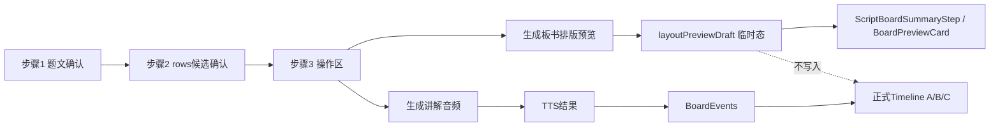
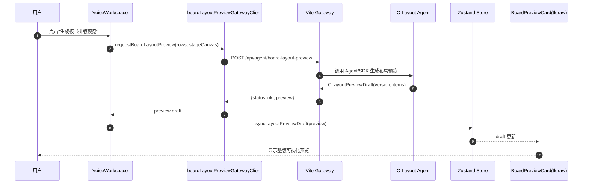
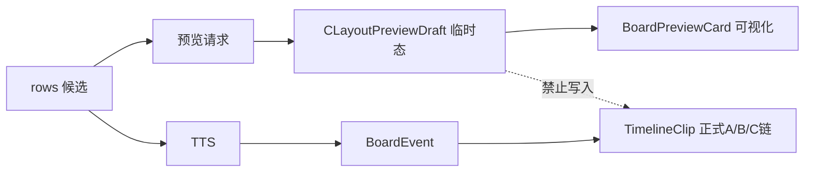
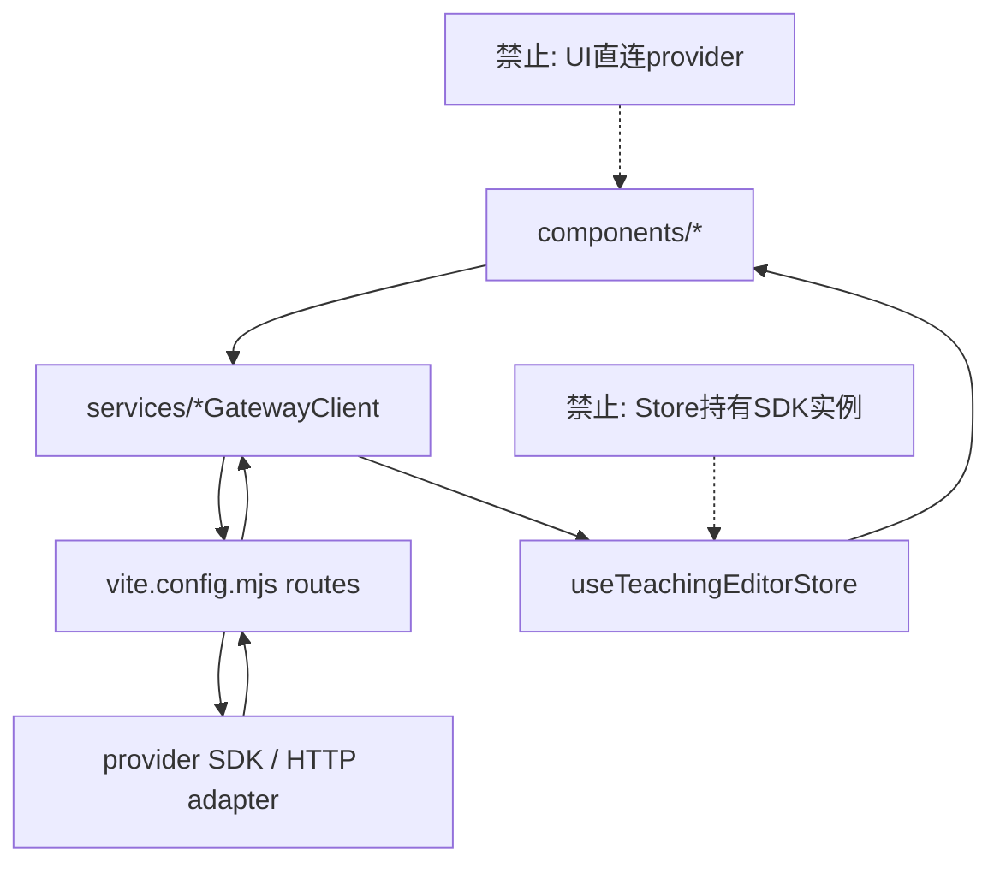

# 落地项目开发说明（代码可直敲版）

## 2026-05-30 批注

| 字段 | 内容 |
| --- | --- |
| 批注日期 | 2026-05-30 |
| 原记录状态 | 部分有效 |
| 当前真相文件 | `当前项目全局认知图与批注说明.md` |
| 仍然有效 | 第三步临时预览态的身份、`rows -> TTS -> BoardEvent -> TimelineClip(kind='board') -> StagePlayback` 正式链路、四区标签必须存在、预览不写正式 timeline 真相、统一配置/边界/验收纪律，这些仍然有效。 |
| 已被覆盖 | 文中多处“tldraw-first / 预览和主舞台都使用 tldraw 承载 / tldraw 作为统一画布框架底座 / 当前主舞台保持 tldraw 原生画笔能力”等实现判断已过期。 |
| 为什么覆盖 | 目前项目认知已明确：第一步上传识别、第二步自动生成到第三步流程是正确的；问题集中在第四步舞台承载与录屏层。正式主舞台已切到 drawboard 路线，且 `standalone=konva-proof` 已证明 Konva 内容层可以消费现有参数真相。 |
| 下一步 | 不重写前三步，不伪造历史；以后继续在本文件保留旧施工图价值，并通过批注说明哪些实现假设属于旧阶段。正式 current truth 以批注文档和当前代码路径为准。 |

# 落地项目开发说明（代码可直敲版）

> 目标：让开发者只看本文件即可按步骤实现第三步“整版板书可视化预览”能力，并保证不污染正式 A/B/C 真相链。

---

## 0.3 节点闭环与文档纪律（强制）

每完成一个节点，必须执行以下闭环：
1. 节点反思自审（红/黄/绿）
2. 确认结论写入升级说明书
3. 同步更新开发文档与映射表
4. 补齐可复现细节（字段、调用、边界、流程图、验收证据）

目标：当出现灾难或人员切换时，能够仅凭图纸文档完整复现，而不是依赖口头记忆。

---

  1. 第三步新增 `生成板书排版预览` 按钮
  2. 新增临时预览请求链路（前端 service + vite gateway）
  3. 新增临时预览状态（store）
  4. 侧边预览卡展示整版可视化结果（tldraw 承载）
- 不在本轮：
  - 把预览结果直接落为正式 timeline C clip
  - 改动现有 A/B/C 正式生成主链

---

## 1. 产品与架构定位（不可漂移）

### 1.1 产品定位
本项目是**高仿直播板书解题工作台**，不是通用白板。

### 1.2 本轮业务目标
甲方担心板书整体视觉效果，需要在第三步提前看整版排版：
- 看疏密
- 看层次
- 看分区
- 看阅读顺序

### 1.3 数据身份
- 预览是**临时态**（ephemeral）
- 仅用于视觉评审
- 不写正式 `TeachingProject.timeline` 真相

---

## 2. 技术栈与依赖（本功能相关）

- React 19
- TypeScript 5.9
- Zustand 5
- Ant Design 6
- tldraw 5
- Vite dev middleware（本地网关）

原则：
- 预览渲染统一靠 tldraw
- 不新建第二套 HTML 绝对定位渲染系统
- tldraw-first：以 tldraw 作为统一画布框架与标准转换底座，优先复用其 shape/store/ui 能力做项目转换
- 禁止扩散手搓三无运行时（无稳定契约、无回归基线、无可维护边界）的临时实现

---

## 2.1 前端说明（必须统一）

> 本节是 UI 与交互实现口径，避免第一二三步各自为政。

### 2.1.1 页面结构与组件树

```text
App
├─ Header（状态条 + 配置 + 档案动作）
├─ workspace-grid
│  ├─ left-sider: AssetPanel
│  │  └─ AssetWorkflowTabs
│  │     ├─ problem: ProblemWorkspace
│  │     ├─ scriptBoard: ScriptBoardSummaryStep
│  │     ├─ voiceAudio: VoiceWorkspace
│  │     └─ voiceTiming / all: 资产视图
│  ├─ main: StagePreview(TldrawStagePreview) + TeachingTimeline
│  └─ right-sider: InspectorPanel
└─ ScriptAgentWorkspace(Modal)
```

### 2.1.2 前端三步统一规则

1. **同一壳层**：三步统一使用 Step Card + 状态 Tag + 主动作区。
2. **同一状态语义**：`idle/loading/success/error` 命名一致。
3. **同一错误展示**：错误统一展示在步骤卡内 Alert，不浮动散落。
4. **同一回调入口**：步骤触发只通过显式 callback，不跨组件直改 store。
5. **同一文案口径**：
   - 第二步：候选内容确认（rows）
   - 第三步：排版预览 + 音频生成（并列动作）
6. **打开与生成语义分离（必须）**：
   - `打开查看` = 进入面板查看/编辑，不自动生成
   - `重新生成` = 用户对当前结果不满意时，显式触发再生成
   - 禁止把“打开”定义成“自动生成”

### 2.1.3 第三步 UI 设计（必须）

在 `VoiceWorkspace` 的 `voice-action-card` 内并列两个主动作：

- 按钮A：`生成板书排版预览`
  - 作用：生成临时可视化整版预览
  - 输出：`layoutPreviewDraft`（临时态）
  - 不触发：timeline 写入

- 按钮B：`生成讲解音频`
  - 作用：走现有 TTS 正式链
  - 输出：voice assets + boardEvents + timeline

UI 行为约束：
- 两按钮有独立 loading 状态，互不覆盖。
- 预览失败不阻断音频按钮。
- 音频失败不清空已生成预览。

### 2.1.4 侧边预览区设计（ScriptBoardSummaryStep）

`ScriptBoardSummaryStep` 中新增 `BoardPreviewCard` 展示区：
- 标题：`板书排版预览（临时）`
- 说明：`用于视觉评审，不写正式C真相`
- 主体：只读 tldraw 预览
- 空态：`暂无预览，去第三步点击“生成板书排版预览”`

### 2.1.4.1 画布四区标签映射（必须）

这四个标签是后续 C 站位与排版的来源，不可缺失：
- `题目` -> `开场读题`
- `分析` -> `分析题目`
- `解答` -> `解题步骤 A1/B1/C1...`
- `总结` -> `梳理总结`

要求：
- rows 在生成预览时必须能映射到四区标签
- 预览布局必须基于四区标签分组，而不是纯顺序散排
- 后续正式 C 站位逻辑与该映射保持同源口径

### 2.1.5 样式与单位统一

- 页面壳层：`px/rem + token`（间距、字号、边框）
- 画布对象：`%`（x/y/width）
- 禁止同语义混用绝对与相对单位
- 预览和主舞台都使用 tldraw 承载，避免两套视觉系统

### 2.1.6 前端交互 Mermaid（步骤视角）



---

## 3. 现有链路（必须先理解）

### 3.1 正式链路（保持不改）
`rows -> TTS -> BoardEvent -> TimelineClip(kind='board') -> StagePlayback`

## 3.1 关键兼容边界（必须保留，不得弱化）

### 3.1.1 阿里云语音数学转义边界（TTS前置）

> 这是已验证过的关键逻辑，不能丢、不能简化成“直接把原文丢给 TTS”。

统一入口：
- `src/modules/speechText/aliyunMathSpeechText.ts`
- 使用 `prepareAliyunMathSpeechText()` 做 TTS 前置处理

必须保留的处理能力：
1. 修复常见 LaTeX 断裂（`rac`/`frac` 漏反斜杠）
2. 识别并处理数学分隔符（`$...$`、`$$...$$`、`\(...\)`、`\[...\]`）
3. 分数/根号/幂次/百分号等中文可读化
4. 运算符口播映射（`+ - × ÷ = ≤ ≥ ≠ ≈ ±` 等）
5. 在不改业务真相的前提下做文本转义，不改 rows 结构

约束：
- 所有 TTS 请求必须走该入口
- 禁止组件层自己拼“临时数学转义”

### 3.1.2 数学公式、手写板书字体、页面默认字体边界

统一职责拆分：
1. **公式显示**：`FormulaText`（KaTeX）只负责显示，不做 TTS 规范化
   - 文件：`src/components/FormulaText.tsx`
2. **文本路由**：`mathBoardText/boardTextDisplayRoute` 决定 handwriting 还是 formula
   - 文件：`src/modules/boardSticker/mathBoardText.ts`
3. **手写字体支持判断**：`isBoardTextSupportedByHandwritingFont()`
   - 支持：数字、英文、常用中文、ASCII 标点、常用数学符号、上下标、希腊字母
   - 结构数学（多层上下标/LaTeX结构）走 formula 路由

禁止事项：
- 禁止把“页面默认字体”口径混入“手写板书字体支持”判断
- 禁止跳过路由函数在组件里直接 if-else 分流公式/手写
- 禁止把结构数学强行走手写字体导致乱码或歧义

### 3.1.3 字符支持边界（重要）

当前有效口径：
- `mathBoardText.ts` 中的字符白名单与结构数学判定是当前执行边界
- 变更字符支持必须同步：
  1) 代码判定
  2) 检查脚本（如 handwriting support check）
  3) 文档说明

---

## 3.2 本地保存、缓存策略与 tldraw 承载边界

### 3.2.1 本地保存/缓存策略（保留）

当前策略是三层：
1. `localStorage`（轻快照）
   - project / pendingProject / scriptAgentCandidateDraft / config
2. Dexie IndexedDB（当前快照 + 命名快照）
   - `src/modules/localTaskArchive/localTaskDb.ts`
3. 文件系统归档导出（用户授权目录）
   - `src/modules/localTaskArchive/localTaskArchive.ts`

关键点：
- 播放时规避高频持久化写入（防卡顿）
- blob 链接不作为稳定归档真相

### 3.2.2 新增临时预览态策略（已钉死）

`layoutPreviewDraft` 定位：
- 临时态，仅服务视觉评审
- 不写正式 timeline
- 不并入正式归档真相
- 可在切题/换稿时清空

### 3.2.3 tldraw 承载策略（框架优先）

- tldraw 是统一画布框架底座（stage/preview 承载）
- 业务真相仍由 `TeachingProject + store` 承载
- `persistenceKey` 是编辑器级记忆，不抢业务真相主导权
- 禁止再造第二套平行渲染系统


## 4.1 输入：rows（来自 ScriptAgentDraft.rows）
```ts
// 复用现有定义
// src/domain/teachingProject.ts
export type ScriptAgentDraftRow = {
  id: string
  chainKey?: string
  section: string
  stepLabel: string
  voiceText: string
  boardSlice: string
}
```

## 4.2 输入：stageCanvas（来自 project.stage.canvas）
```ts
export type StageCanvasConfig = {
  preset: StageCanvasPreset
  width: number
  height: number
  background: string
  boardFontFamily: string
  boardFontName: string
  boardFontSize: number
  boardFontUrl: string
}
```

## 4.3 新增：临时预览数据结构（建议放 `src/domain/teachingProject.ts`）
```ts
export type CLayoutPreviewItem = {
  id: string
  rowId: string
  chainKey?: string
  text: string
  xPercent: number
  yPercent: number
  widthPercent: number
  fontSize: number
  groupKey: string
  stackIndex: number
}

export type CLayoutPreviewDraft = {
  version: 'c-layout-preview-v1'
  generatedAt: string
  items: CLayoutPreviewItem[]
}
```

约束：
- `xPercent/yPercent/widthPercent` 全部是相对单位（0-100）
- `text` 优先取 boardSlice 非空行
- `stackIndex` 越大越后绘制

## 4.4 API 契约

### Request
```json
{
  "problemText": "string",
  "rows": [
    {
      "id": "row-1",
      "section": "解题环节",
      "stepLabel": "第一步",
      "voiceText": "...",
      "boardSlice": "...",
      "chainKey": "step-1"
    }
  ],
  "stageCanvas": {
    "width": 1920,
    "height": 1080,
    "background": "#ffffff",
    "boardFontName": "...",
    "boardFontFamily": "...",
    "boardFontSize": 72
  }
}
```

### Response
```json
{
  "status": "ok",
  "preview": {
    "version": "c-layout-preview-v1",
    "generatedAt": "2026-05-28T12:00:00.000Z",
    "items": [
      {
        "id": "preview-item-1",
        "rowId": "row-2",
        "chainKey": "step-1",
        "text": "...",
        "xPercent": 30,
        "yPercent": 40,
        "widthPercent": 26,
        "fontSize": 64,
        "groupKey": "solving",
        "stackIndex": 1
      }
    ]
  }
}
```

### Error
```json
{
  "status": "failed",
  "error": {
    "code": "INVALID_ROWS",
    "message": "rows is empty"
  }
}
```

---

## 5. 模块拆分与职责（防堆砌）

## 5.1 UI触发层：VoiceWorkspace
文件：`src/components/VoiceWorkspace.tsx`

新增：
- 按钮：`生成板书排版预览`
- 本地状态：`isGeneratingLayoutPreview / layoutPreviewError`
- 触发：调用 `requestBoardLayoutPreview(...)`
- 成功：`onSyncLayoutPreviewDraft(preview)`

不做：
- 不在这里写布局算法
- 不在这里做 tldraw shape 转换

## 5.2 服务层：boardLayoutPreview client
建议新文件：`src/services/boardLayoutPreviewGatewayClient.ts`

导出函数签名：
```ts
export async function requestBoardLayoutPreview(input: {
  problemText: string
  rows: ScriptAgentDraftRow[]
  stageCanvas: StageCanvasConfig
  config: AppConfig['scriptAgent']
}): Promise<CLayoutPreviewDraft>
```

## 5.3 网关层：vite middleware
文件：`vite.config.mjs`

新增路由：
- `POST /api/agent/board-layout-preview`

实现原则：
- 与 `/api/agent/script-board` 复用同类鉴权和错误格式
- 输出固定 JSON schema

## 5.4 状态层：Zustand store
文件：`src/store/useTeachingEditorStore.ts`

新增状态：
```ts
layoutPreviewDraft: CLayoutPreviewDraft | null
```

新增 action：
```ts
syncLayoutPreviewDraft: (draft: CLayoutPreviewDraft | null) => void
clearLayoutPreviewDraft: () => void
```

硬约束：
- 不写入 `project.timeline`
- 不写入正式 `cAssets`
- 不影响 `applyTtsSentenceResults/applyBoardEventsToTimeline`

## 5.5 预览渲染层：BoardPreviewCard
文件：`src/components/BoardPreviewCard.tsx`

改造为：
- 输入 `layoutPreviewDraft + stageCanvas`
- 内部只读 tldraw 画布渲染整版 preview
- 若无数据显示 placeholder

建议 props：
```ts
{
  draft: CLayoutPreviewDraft | null
  stageCanvas: StageCanvasConfig
}
```

## 5.6 脚本摘要层挂载
文件：`src/components/ScriptBoardSummaryStep.tsx`

新增：
- 引入并渲染 `BoardPreviewCard`
- 展示文案明确：这是“临时排版预览”，不是正式 C

---

## 6. 布局规则（预览算法口径）

> 本轮先给“稳定可读”的基础排版算法，不追求最优美学。

### 6.0 区域来源（先于算法）
先按业务标签把 rows 映射到四区，再做各区内部排版：
- 开场读题 -> 题目区
- 分析题目 -> 分析区
- 解题环节（A1/B1/C1...）-> 解答区
- 梳理总结 -> 总结区

若 section 缺失或异常，落到 `ungrouped` 并在预览中高亮提示，禁止静默吞并。

## 6.1 输入过滤
- 只取 `rows` 中 `boardSlice.trim()` 非空项
- 保留原有顺序（按 rows 顺序）

## 6.2 分组策略
- 按 `section` 分组：开场/分析/解题/总结
- 每组内按 rows 顺序排

## 6.3 空间策略（默认 16:9）
- 画布逻辑区间：
  - 左边距：8%
  - 右边距：8%
  - 顶边距：10%
  - 底边距：10%
- 组间距：4%
- 行间距：2.4%

## 6.4 单项默认
- `widthPercent`: 22~32（按文本长度轻微放缩）
- `fontSize`: 由 `stageCanvas.boardFontSize` 派生并 clamp
- `xPercent/yPercent`: 由分组行列算法给出

## 6.5 冲突回退
- 如果超出纵向空间：压缩行间距，再压缩字号
- 仍超出：标记 `groupKey=overflow` 并靠下堆叠

---

## 7. 路由与函数明细（开发清单）

## 7.1 需修改文件
1. `src/components/VoiceWorkspace.tsx`
2. `src/workflow/createAssetWorkflowSteps.tsx`
3. `src/components/ScriptBoardSummaryStep.tsx`
4. `src/components/BoardPreviewCard.tsx`
5. `src/store/useTeachingEditorStore.ts`
6. `src/domain/teachingProject.ts`
7. `vite.config.mjs`

## 7.2 建议新增文件
1. `src/services/boardLayoutPreviewGatewayClient.ts`
2. `src/modules/layoutPreview/createLayoutPreviewDraft.ts`（纯函数算法）
3. `src/modules/tldrawStage/layoutPreviewToTldrawShapes.ts`

---

## 8. 注意事项（高风险点）

1. **不要把预览写进正式 timeline**
   - 禁止在 preview action 里触发 `applyBoardEventsToTimeline`

2. **不要让预览依赖 TTS 完成**
   - 预览必须能在“仅有 rows”时工作

3. **不要把 boardLayout 变成预览存储桶**
   - boardLayout 仍是内容候选文本语义

4. **不要新增第二套渲染真相**
   - 预览也走 tldraw 承载

5. **不要破坏现有第三步语音链路**
   - 现有 `生成讲解音频` 行为必须保持

---

## 9. 录制边界（重申）

必录：
- 舞台底板、C 内容、金手指、A 音频

禁录：
- 侧栏、顶部、时间轴、弹窗、非舞台 UI

实现：
- 优先浏览器原生能力
- 不做重型自研录制优化

---

## 10. 验证清单（按用户流程）

### 10.1 功能流程
1. 上传题目并确认题文
2. 打开 Agent 进入查看/编辑，用户按需点击“重新生成”得到 rows
3. 第三步点击 `生成板书排版预览`
4. 侧边看到整版可视化预览
5. 调整 rows 后再次预览，结果同步变化
6. 点击 `生成讲解音频`，A/B/C 主链正常

### 10.2 断言
- 预览是临时态（刷新可丢）
- 预览不写正式 timeline
- 语音链不回归

### 10.3 工具检查
- `npm run typecheck`
- UI 手动检查（主流程）

---

## 11. 代码注释与命名规范（本功能）

- 预览相关统一前缀：`layoutPreview*` / `CLayoutPreview*`
- action 命名：`syncLayoutPreviewDraft / clearLayoutPreviewDraft`
- 文案必须写“预览”与“临时态”，避免误解为正式写入

---

## 12. 完成定义（DoD）

满足以下全部条件才算完成：
1. 第三步新增预览按钮可用
2. 可见整版预览且可重复生成
3. 预览与正式 A/B/C 数据链隔离
4. 现有语音链路无回归
5. 类型检查通过
6. 用户视角可完整走通“预览->调整->再预览->再生成音频”

---

## 13. Agent 协作与 SDK 实施重点（后续长期主线）

> 这是本项目后续可持续扩展的核心。所有 Agent 能力必须按“契约 -> 适配器 -> 网关 -> 提供方 SDK”分层。

### 13.1 Agent 分工（硬边界）

1. **Script Agent（内容候选）**
   - 产出：`rows`
   - 职责：讲解与板书候选内容
   - 不负责：最终排版坐标、正式 timeline 写入

2. **C-Layout Agent（视觉预览）**
   - 产出：`CLayoutPreviewDraft`
   - 职责：整版板书位置/分区/层次预览
   - 不负责：A/B 正式时序落库

3. **Workflow Orchestrator（前端编排层）**
   - 职责：触发、状态管理、回显、重试
   - 不负责：模型 prompt 拼接细节、提供方 SDK 调用细节

### 13.2 SDK 分层规范（禁止越层）

- UI 组件层：只调用 `service` 函数
- Service 层：只处理请求/响应 DTO 与错误映射
- Gateway 层（vite middleware）：统一鉴权、provider 调用、响应 schema
- Provider SDK/HTTP 客户端层：只在 gateway 内部，不允许 UI 直连

**禁止项：**
- 组件直接 `fetch` 第三方模型 endpoint
- 在组件拼接 provider 特定协议字段
- 让 store 持有 provider SDK 状态对象

### 13.3 Agent 契约版本化（必须）

每个 Agent 能力的响应都带 `version`：
- Script Agent：`rows-contract-v1`
- C-Layout Agent：`c-layout-preview-v1`

升级规则：
- 新增字段：向后兼容
- 字段语义变化：必须升版本
- UI 只消费已声明版本字段，不猜测未知字段

### 13.4 Agent 调用治理（可靠性）

- 每次请求生成 `requestId`
- 前端仅消费“当前最新 requestId”响应，防止旧响应覆盖新状态
- 超时、取消、重试策略统一在 service 层
- 错误统一归一化为：`code/message/retryable`

建议错误类型：
- `INVALID_INPUT`
- `UPSTREAM_TIMEOUT`
- `UPSTREAM_BAD_RESPONSE`
- `SCHEMA_VALIDATION_FAILED`

### 13.5 观测性（必须可追踪）

最少打点：
- 请求发起时间、返回时间、耗时
- 输入规模（rows 数量、boardSlice 数量）
- 响应版本、item 数量
- 是否命中 fallback

注意：日志不写用户敏感正文，写统计摘要。

---

## 14. Agent 协作 Mermaid 图（必须与代码一致）

### 14.1 第三步排版预览协作时序



### 14.2 与正式 A/B/C 主链的隔离关系



### 14.3 模块协作拓扑（代码分层）



---

## 15. 与 tldraw 能力的结合点（优先复用）

### 15.1 必复用能力
- `Tldraw` 只读画布承载预览
- `editor.createShapes` 批量创建文本 shape
- `editor.zoomToBounds` 自动适配整版可见区域
- `toRichText` 文本入 shape 规范化

### 15.2 不要重复造轮子
- 不再单独造 HTML 绝对定位排版系统
- 不再造第二套 canvas text 布局引擎
- 不把预览和主舞台拆成两种语义模型

### 15.3 预览 shape 建议
- type: `text`
- fields: `x/y/w/font/color/richText`
- 坐标由 `% -> px` 映射得到
- z 顺序由 `stackIndex` 控制

---

## 16. 开发注意事项（Agent/SDK 特别版）

1. **先校验输入再请求 Agent**
   - rows 为空直接返回可读错误
2. **响应必须做 schema 验证**
   - version/items 类型不符即 fail-fast
3. **防止并发覆盖**
   - 仅接受最后一次请求结果
4. **临时态可清空**
   - 切题/换稿时清理 preview draft
5. **主链零污染**
   - preview action 内绝不调用 timeline 写入 action

---

## 17. 最终验收补充（Agent 协作维度）

在 DoD 基础上增加：
1. 预览请求失败时有可理解错误提示，不影响后续生成音频
2. 连续两次快速点击预览，最终只展示最新结果
3. 修改 rows 后重生预览，画面可见变化且不影响已有正式 timeline
4. 预览调用链日志可追踪（requestId + 耗时 + 结果数量）

---

## 18. 控件责任九问落地表（关键控件）

> 下面是当前主链关键控件的责任快照，按“纪律高于一切”执行。

| 什么控件 | 干什么的 | 负责什么 | 不负责什么 | 影响关系 | 来源依据、受什么影响 | 参数字段 | 对应的前端 | 控件名称 | 是否唯一 |
| --- | --- | --- | --- | --- | --- | --- | --- | --- | --- |
| ProblemWorkspace | 题文确认入口 | 题文编辑与确认、进入第二步 | 不做 TTS，不写 timeline | 题文 -> rows 生成入口 | 受 recognition 配置和 problemText 状态影响 | problemText / recognitionError / isProblemConfirmed | `src/components/ProblemWorkspace.tsx` | 题文确认/讲解生成 | 是 |
| ScriptBoardSummaryStep | 第二步摘要与预览承载 | 展示文稿候选、板书候选、侧边预览卡 | 不直接生成，不写正式 A/B/C | rows/candidate -> 用户确认 -> 第三步 | 受 scriptText/boardLayout/layoutPreviewDraft 影响 | scriptTextAsset / boardLayoutAsset / layoutPreviewDraft / stageCanvas | `src/components/ScriptBoardSummaryStep.tsx` | 文稿与板书 | 是 |
| VoiceWorkspace | 第三步动作中枢 | 生成排版预览、生成讲解音频 | 不做布局算法本体，不做 tldraw shape 构建 | 点击 -> 请求 -> 状态更新 | 受 scriptAgentCandidateDraft、ttsConfig、stageCanvas 影响 | rows / stageCanvas / scriptAgentConfig / ttsConfig | `src/components/VoiceWorkspace.tsx` | 生成板书排版预览 / 生成讲解音频 | 是 |
| BoardPreviewCard | 侧边整版预览 | 只读显示临时排版预览 | 不写 timeline，不做业务决策 | layoutPreviewDraft -> tldraw shape -> 画面 | 受 draft items 与 canvas 比例影响 | draft.version/items、stageCanvas | `src/components/BoardPreviewCard.tsx` | 板书排版预览（临时） | 是 |
| TldrawStagePreview | 主舞台承载 | 渲染 ABC 舞台、接收交互回写 C 视觉 patch | 不拥有 A/B/C 真相源 | timeline clip -> tldraw shapes -> 画面 | 受 boardClips/playhead/canvas 影响 | boardClips / selectedClip / canvas / playheadMs | `src/components/TldrawStagePreview.tsx` | 预览舞台 | 是 |
| GoldenFingerCanvasLayer | 标注隔离层 | 画笔标注、事件隔离、overlay绘制 | 不写 base A/B/C | 工具模式 -> 指针拦截/穿透 -> overlay | 受 activeToolMode/strokeColor/strokeWidth 影响 | mode / color / width / strokes | `src/components/GoldenFingerCanvasLayer.tsx` | 标注隔层板 | 是 |
| useCanvasRecorder | 舞台录制 | 仅录舞台合成帧和音轨 | 不录壳层 UI，不做业务状态改写 | base/content/overlay + audio -> media file | 受可用 canvas 和浏览器编码能力影响 | baseCanvas/contentCanvas/overlayCanvas | `src/modules/stageRecorder/useCanvasRecorder.ts` | 录制/下载 | 是 |

---

## 19. 关键底层边界（军工协作口径）

### 19.1 画布属性边界
- 真相字段：`StageCanvasConfig`
- 默认配置写入：`defaultConfig.stageDefaults.canvas`
- 用户修改入口：`AppSettingsDrawer -> CanvasSettings`
- 运行态唯一来源：`project.stage.canvas`

### 19.2 C 属性边界
- 当前过渡态：B/C 同住 `TimelineClip(kind='board')`
- C 视觉字段：`label/xPercent/yPercent/widthPercent/fontSize/drawSpeed/reveal*`
- C 编辑入口：`BoardClipInspector` + 舞台交互回写
- 禁止：B 调整隐式改写 C 内容；C 调整反写 A 时钟

### 19.3 金手指隔离保护边界
- `off`：指针穿透，C 可编辑
- `pen/eraser/highlight/circle/cross`：拦截指针，保护底层元素
- 数据隔离：只在 overlay 层，不污染 base A/B/C
- 录制可见：overlay 可录入，但不回写真相
- 当前主舞台策略：保持 tldraw 原生画笔/橡皮能力，并通过受管形状缺失修复保护 ABC 基础元素

### 19.4 C-Agent 升级注意事项
- 负责：视觉排版建议（站位/分组/层次）
- 不负责：正式 timeline 真相写入
- 必须绑定四区标签来源：
  - 题目 -> 开场读题
  - 分析 -> 分析题目
  - 解答 -> A1/B1/C1...
  - 总结 -> 梳理总结

### 19.5 阿里云语音数学转义边界
- 统一入口：`prepareAliyunMathSpeechText()`
- 必留能力：LaTeX 修复、分隔符识别、分数/根号/幂次/运算符口播映射
- 禁止组件层临时拼转义

### 19.6 公式/手写/默认字体边界
- 公式显示：`FormulaText`（KaTeX）只负责显示
- 分流判断：`mathBoardText` / `boardTextDisplayRoute`
- 字符支持：以代码白名单和结构数学判定为准，变更必须同步检查脚本

### 19.7 录制边界
- 录入：舞台底图 + C + GoldenFinger + A 音轨
- 排除：侧栏、顶部、时间轴、弹窗、非舞台 UI
- 原则：浏览器能力优先，不走重型手搓录制系统

---

## 21. 节点复盘（2026-05-29）

### 21.1 本节点完成项
1. 四区标签映射从软约定升级为网关硬约束（题目/分析/解答/总结）。
2. 主舞台工具激活时增加底层元素保护补丁，防止 ABC 受误删影响。
3. 文档同步更新，明确当前保护策略和后续覆盖层收敛方向。

### 21.2 九问复盘（本节点）

| 什么控件 | 干什么的 | 负责什么 | 不负责什么 | 影响关系 | 来源依据、受什么影响 | 参数字段 | 对应的前端 | 控件名称 | 是否唯一 |
| --- | --- | --- | --- | --- | --- | --- | --- | --- | --- |
| board-layout-preview gateway | 生成临时整版排版预览 | 解析 rows，归一化四区标签，产出 CLayoutPreviewDraft | 不写正式 timeline、不改 A/B 真相 | rows -> preview draft -> BoardPreviewCard | 受 scriptAgentConfig / stageCanvas / rows.section 影响 | rows, stageCanvas, preview.items(groupKey/x/y/width/fontSize) | `vite.config.mjs` 路由 `/api/agent/board-layout-preview` | 生成板书排版预览 | 是 |
| TldrawStagePreview 工具保护补丁 | 在主舞台工具激活时保护底层 ABC 元素 | 检测受管形状缺失并自动修复；限制主舞台 eraser 对底层元素破坏 | 不承担覆盖层擦除完整能力，不改业务真相字段来源 | activeToolMode -> editor store listener -> managed shapes repair | 受 boardShapeMeta / activeToolMode / syncAbcStageToTldraw 影响 | activeToolMode, boardShapeMeta, managedShapeIds | `src/components/TldrawStagePreview.tsx` | 预览舞台（保护补丁） | 是 |

### 21.3 剩余风险（红黄绿）
- 黄：主舞台保护目前通过“受管形状缺失修复”兜底，后续仍需把覆盖层能力收敛成稳定隔离方案。
- 绿：四区标签映射已入硬逻辑，不再依赖口头约定。
- 绿：本节点 typecheck 已通过。

---

## 22. 节点复盘（2026-05-29，连续收口）

### 22.1 节点A：四区标签从规则到代码硬约束

**完成内容**
1. 网关 `/api/agent/board-layout-preview` 输出 groupKey 强制归一化到四区：题目/分析/解答/总结。
2. fallback 排版按四区分组布局，不再按纯顺序散排。
3. 主舞台标签补齐为四区：题目/分析/解答/总结。

**影响**
- C-Agent 预览到画布的分区来源从“软约定”升级为“硬规则”。
- rows.section 与画布标签映射关系稳定，减少后续漂移风险。

### 22.2 节点B：恢复 tldraw 原生能力并保留保护边界

**完成内容**
1. 恢复主舞台 `eraser` 原生能力，避免阉割式降级。
2. 保留主舞台受管形状缺失修复补丁，防止底层 ABC 元素被误删后失真。
3. 同步更新文档口径：框架能力优先 + 边界保护并行。

**影响**
- 画笔体验向 tldraw 官方能力靠拢。
- 保留“纪律边界”：不允许底层真相静默损坏。

### 22.3 节点C：PC工作台低分辨率可用性收口

**完成内容**
1. 固定工作台三列骨架收口：420 / min 620 / 280。
2. 降低最小宽度至 1160，减少中低分辨率挤爆概率。
3. 主列最小宽度与分栏内最小高度约束补齐。

**影响**
- 低分辨率学校电脑下“按钮够不到、整页拉很长”问题缓解。
- 继续坚持 PC 工作台固定布局，不走便携端响应式漂移。

### 22.4 快速验收结果
- typecheck：通过
- 四区标签接口实测：返回 `题目/分析/解答/总结`
- 第二步双语义按钮：`打开查看` + `重新生成` 可见


